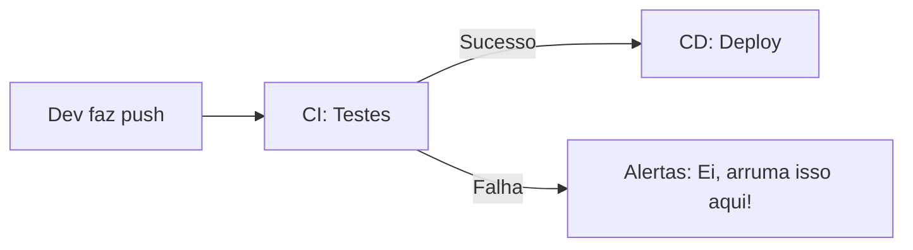

**Por que aprender CI & CD é tão importantes?**
>  ⏱️ **Economizam tempo**: Deploy de minutos em vez de horas  
>  🛡️ **Previnem vergonhas**: Nada quebrado no ar!  
>  🧠 **Liberam sua cabeça**: Foca no código, o resto é com os bots 
## 🚀 Continuous Deployment (CD): O "Robozinho" do Deploy  
É o processo de **automatizar a entrega** de novas funcionalidades direto pro servidor. Imagine ele como um entregador de pizza ultra-rápido que, toda vez que você termina uma feature, leva ela prontinha pro cliente sem você precisar sair de casa!

### Como funciona na prática?  
1. Você faz um commit na `main` do [[Repositórios#**1. Repositório Local**|seu repositório local]].  
2. Manda pro [[Repositórios#**2. Repositório Remoto (Origin)**|Repositório de origem (GitHub)]] com `git push` 💻.  
3. O CD entra em ação:  
   - 👀 **Monitora** o repositório remoto 24/7  
   - ✅ **Roda testes** (se você configurou)  
   - 🚚 Se tudo ok, **faz deploy automático** pro servidor  

É tipo ter um assistente que grita "SHIP IT!" 🚢 toda vez que seu código tá pronto!

---

## 🧪 Continuous Integration (CI): O Testador Chato, mas útil
O CI é aquele amigo que **revise seu código antes de postar nas redes sociais**. Ele garante que nada vai "estragar a foto" do seu projeto!

### Tá, mas o que ele faz exatamente?  
1. Você faz push do código (igual ao CD)  
2. O CI:  
   - 🧼 **Limpa a casa**: `npm install`, `pip install -r requirements.txt`  
   - 🚨 **Testa TUDO**: Unit tests, linting, segurança  
   - 📦 Se passar, **empacota** (build) o projeto  
3. Aí sim passa o pacote pro CD fazer deploy  

### Analogia do Chefe de Cozinha 🧑🍳  
Imagine que você é um chef fazendo um novo prato (sua feature). O CI é como:  
1. Você **prova** antes de servir (testes)  
2. Verifica se **tem sal demais** (linting)  
3. Checa se **não vai dar alergia** (segurança)  
4. Só então **entrega ao cliente** (CD)  

### 💡 Dica Bonus  
Configure seu CI/CD pra mandar um meme no Slack quando:  
- Deploy der certo 🎉 → "Deploy feito! cafezinho?"  
- Der erro 💥 → "ALERTA: Alguém esqueceu um `;` aqui!" 
