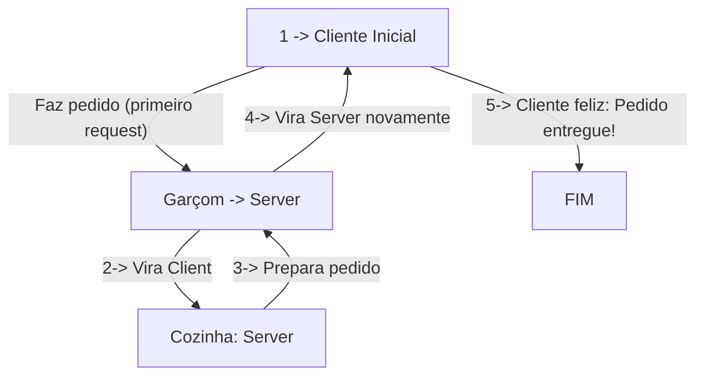
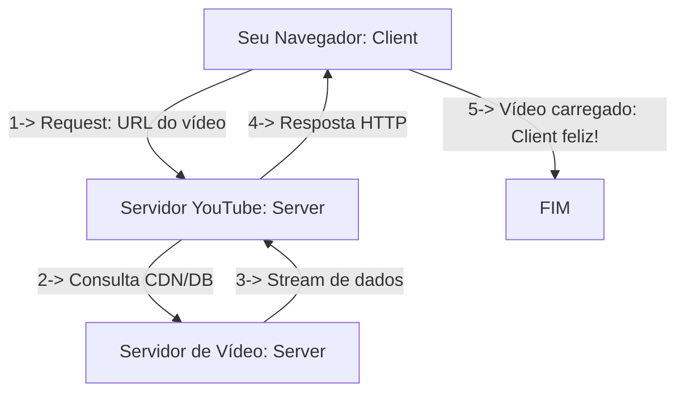

### **Client x Server: Conceito Básico**  
> **Client** = entidade que faz requisições a um servidor.  
> **Server** = entidade que responde às requisições do cliente.  

---

### **Exemplo: Restaurante (Fluxo Cliente-Servidor)**  

#### **Passo a Passo**:  
1. **Cliente faz a 1ª request**:  
   - O cliente pede um prato ao garçom (server).  
2. **Server vira client**:  
   - O garçom (agora como client) leva o pedido à cozinha (novo server).  
3. **Server atual processa**:  
   - A cozinha prepara o pedido e devolve ao garçom.  
4. **Server original entrega**:  
   - O garçom (de volta como server) leva o prato ao cliente inicial.  
5. **Ciclo concluído**:  
   - Cliente recebe tudo que solicitou.  

---

### **Exemplo Tecnológico: Assistir Vídeo no YouTube**  

#### **Passo a Passo Técnico**:  
1. **Request inicial**:  
   - Seu navegador (client) envia uma requisição HTTP para `youtube.com`.  
2. **Cadeia de servidores**:  
   - O servidor do YouTube (server) consulta CDNs (Content Delivery Networks) ou bancos de dados para localizar o vídeo.  
3. **Processamento distribuído**:  
   - Servidores especializados (ex: armazenamento em nuvem) entregam os dados em streaming.  
4. **Resposta final**:  
   - O YouTube (server) envia o vídeo formatado (HTML + player) ao navegador (client).  
5. **Experiência concluída**:  
   - Você assiste ao vídeo sem perceber os 50+ microserviços envolvidos! 🎥  

