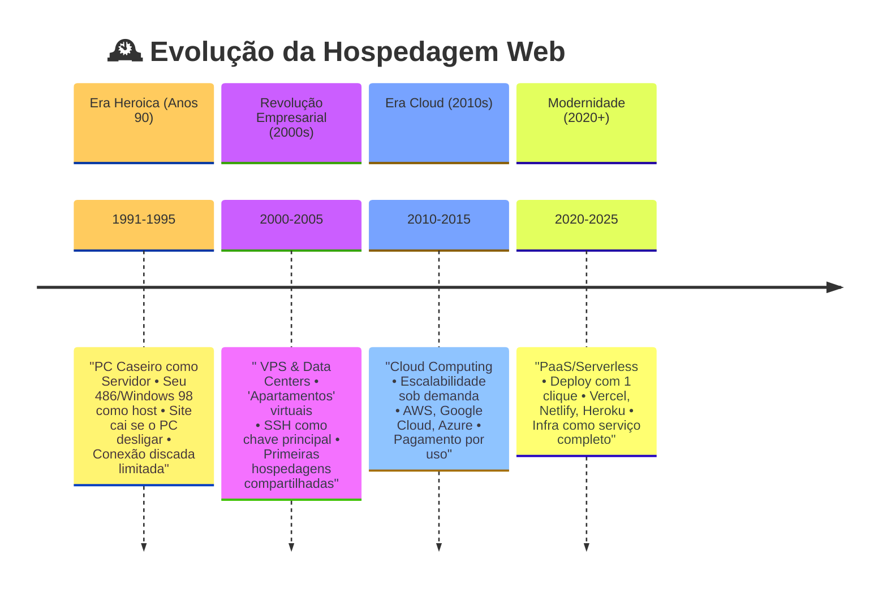

## 🏠 O que é hospedagem?  
É como **alocar um apartamento** na internet - você paga para seu site morar nos servidores de uma empresa, em vez de deixá-lo no seu computador pessoal (que seria como morar na casa dos pais sem privacidade!).  

### Evolução Histórica: Da Gambiarra à Nuvem  

## 🔌 Como funcionava nos anos 90?  
Imagine seu Windows 98 virando um servidor:  
- 💾 Você instalava o Apache manualmente  
- 📞 A internet discada limitava a 5 visitantes simultâneos  
- ⚡ Se alguém ligasse no seu telefone fixo... *adeus site!*  

## ☁️ Como funciona hoje?  
1. **Escolhe seu "pacote de internet"**:  
   - 🏡 **Shared Hosting** (República): R$10/mês, divide servidor com outros sites  
   - 🏢 **VPS** (Kitnet Virtual): R$50/mês, seu cantinho dedicado  
   - 🌎 **Cloud** (Mansão Escalável): Paga só o que usar (AWS, GCP)  

2. **Deploy em 1 clique**:  
   - Conecta seu GitHub → **"Deploy Now"** → Pronto! Seu site tá no ar  

## 💡 Por que ninguém usa PC caseiro hoje?  
| Problema do PC      | Solução Cloud |
| ------------------- | ------------- |
| ⏳ 24/7 ligado       | Uptime 99.9%  |
| 🔌 Gasto de energia | Pay-as-you-go |
| 🛡️ Sem firewall    | Proteção DDoS |

## 🚀 Tipos Modernos de Hospedagem  
1. **PaaS (Platform as a Service)**:  
   - "Netflix de servidores" - você só coloca o código, eles cuidam do resto  
   - Ex: Vercel (frontends), Railway (backends)  

2. **Serverless**:  
   - Funciona só quando alguém acessa (como um Uber da computação)  
   - Cobrado por milissegundo de uso!  

## 🤯 Curiosidade Nerd  
O primeiro site da história (info.cern.ch) em 1991 rodava num computador do CERN com um adesivo escrito:  
**"NÃO DESLIGUE - É SERVIDOR!"**  

