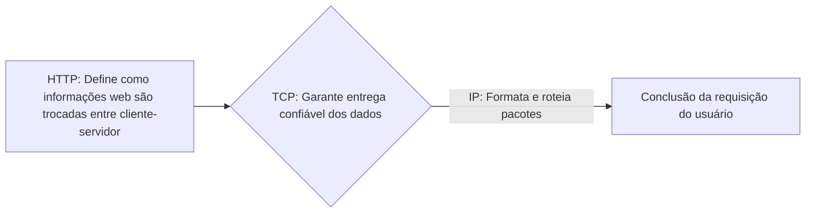

### **Antes de tudo, o que seria um servidor web?**  
> A internet funciona por meio de comunicações via protocolos que mantêm os servidores web operacionais. Esses servidores são computadores (ou redes de computadores) que armazenam e distribuem os arquivos de um site, permitindo que usuários acessem suas páginas.

### **Mas o que é um protocolo?**  
Um protocolo é um **conjunto de regras padronizadas** que permite a comunicação entre partes, respondendo perguntas como:  
> - "Como uma 'conversa' se inicia?"  
> - "Onde as informações devem ser inseridas para transferência?"  
> - "Como obter uma resposta após o envio?"  
> - "Qual o início e o fim do processo?"  

#### **Protocolos na prática: o "telefone sem fio"**  
O conceito existe desde a infância, como na brincadeira do "telefone sem fio". Nela, as crianças definem um protocolo: a informação é transmitida por sussurros sequenciais. A diferença para protocolos de rede é a ausência de algoritmos de **verificação de erros** nessa brincadeira.

#### **Protocolos em camadas**  

### **Principais Protocolos**  

1. **HTTP** (*Hypertext Transfer Protocol*):  
   Gerencia documentos de **hipertexto** (com links para outros documentos), definindo regras para transferência web.  

2. **FTP** (*File Transfer Protocol*):  
   Especializado na transferência de arquivos entre sistemas.  

3. **SMTP** (*Simple Mail Transfer Protocol*):  
   Responsável pelo envio de e-mails entre servidores.  

4. **UDP** (*User Datagram Protocol*):  
   Protocolo de transporte **sem conexão**, ideal para transmissões rápidas (ex: streaming), sem garantia de entrega.  

