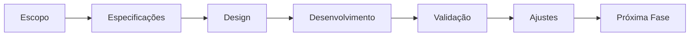
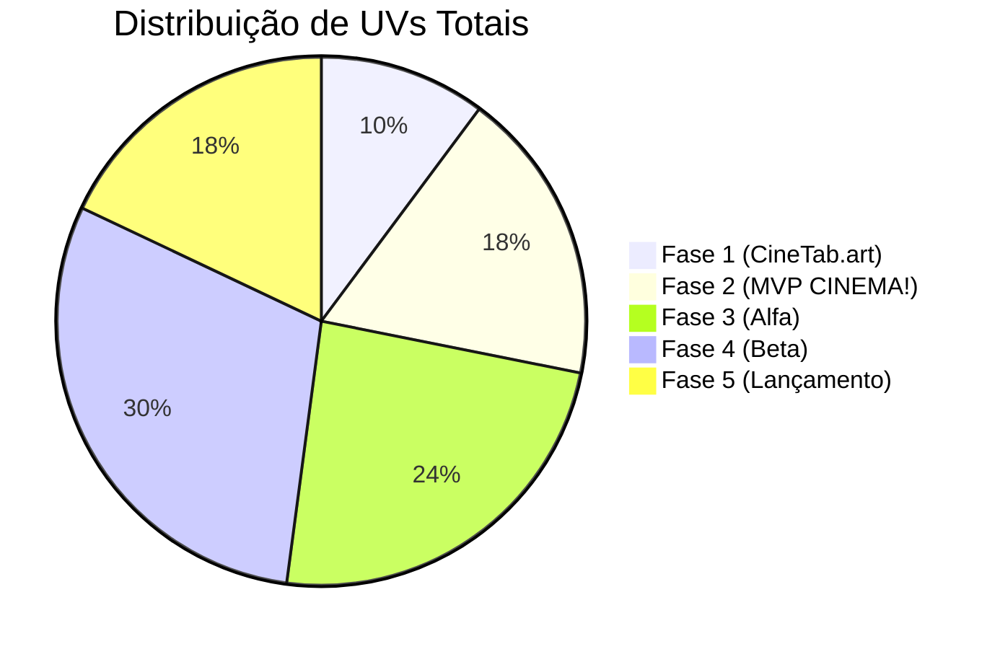

---
status:
  - Em planejamento
start-date: 2025-04-02
responsible: Troli
---
### 📝 Meta-Informações
- **Prazo Estimado para MVP:** Indefinido
- **Prazo Estimado para V1.0:** Sem perspectiva
- **Repositório:** [CineTab](https://github.com/DevTroli/CineTab.art) &  futuramente projeto CINEMA!
- **Documentação Técnica:** [[DOCS TECNICA CINEMA!]] & [Documentação CineTab](https://github.com/DevTroli/CineTab.art/blob/main/README.md)

## 🌐 Visão Geral
### **📌 Descrição**  
O **CINEMA!** & CineTab são **plataformas de discussão cinematográfica**, Aqui, o foco é **debater filmes como arte**, não como produto, em um ambiente livre de elitismo e engajamento forçado.  

### **🎯 Objetivo Principal**  
Resolver a **degradação das discussões sobre cinema** em redes sociais tradicionais, onde:  
✔ **Críticas são reduzidas a notas** (IMDb, Letterboxd).  
✔ **Debates são polarizados** (Reddit, Twitter).  
✔ **Conteúdo é otimizado para algoritmos**, não para pessoas.  

### **👥 Público-Alvo**  
| Tipo de Usuário          | Necessidade                                           | Como o CINEMA! Atende                             |
| ------------------------ | ----------------------------------------------------- | ------------------------------------------------- |
| **Casuais**              | Falar sobre filmes sem julgamento.                    | Sem hierarquia de "críticos vs. leigos".          |
| **Críticos Aspirantes**  | Espaço para análises profundas, não apenas hot takes. | Tags como `#AnáliseProfunda` e debates técnicos.  |
| **Estudantes de Cinema** | Aprender com discussões reais, não apenas teoria.     | Seção `#PorTrásDasCâmeras` com insights práticos. |

### **💎 Proposta de Valor**  
| Diferencial            | CINEMA! vs. Concorrentes                              |
| ---------------------- | ----------------------------------------------------- |
| **Sem Notas/Rankings** | Nada de "5 estrelas" ou TOP 10. Só texto e discussão. |
| **Anti-Gamificação**   | CineCoins recompensam **qualidade**, não volume.      |
| **Moderação Orgânica** | Comunidade autoregulada, sem censura centralizada.    |
| **Acesso Universal**   | Não precisa ser "expert" para participar.             |

## **⚠️ Riscos & Mitigações**  
| Risco                                        | Mitigação                                                                        |
| -------------------------------------------- | -------------------------------------------------------------------------------- |
| **Baixo engajamento inicial**                | Parceria com micro-influencers de cinema (Sites/YouTube).                        |
| **Dependência de moderação voluntária**      | Ferramentas de IA para detectar discurso de ódio (sem banir opiniões polêmicas). |
| **Concorrência de plataformas consolidadas** | Focar em nichos ignorados (ex: filmes regionais).                                |

---
## Progressão CineScale
### Progresso Organico com [[CineScale]] 
![[CineScale#O que é o CineScale?##]]

## Planejamento bem resumido do MVP cinetab.art.br 
#### **🚀 Fase 1: MVP (0-4meses)**  
- **Funcionalidades Críticas:**  
  - Posts em Markdown + sistema de tags (`#Crítica`, `#Debate`).  
  - CineCoins básico (ganhar/gastar).  
  - Moderação por votação (5 reports = ocultação).  
- **Métricas de Sucesso:**  
  - 500 usuários ativos/mês.  
  - 70% dos posts com mais de 3 comentários.  

#### **🛠 Fase 2: Consolidação (4-10 meses)**  
- **Novas Features:**
  - Salas de debate ao vivo (integração com WebSockets).  
  - Badges de reconhecimento (`🎬 Crítico do Povo`).  
- **Parcerias:**  
  - Festivais universitários (ex: FACINE) para curadoria colaborativa.  

#### **🌍 Fase 3: Expansão (6-12 meses)**  
- **CineTab EDU:** Cursos gratuitos financiados por CineCoins.  
- **Licenciamento de Dados:** Relatórios anônimos para pesquisas acadêmicas.  

---

# 🚀 Fase 0:  Planejamentos Iniciais (70★)

## Análise de Mercado ( 15★ )
- [x] Pesquisa de concorrentes diretos e indiretos ( 7★)
- [x] Identificação de diferencias no mercado ( 8★ )

## Idealização ( 15★ )
- [x] Posicionamento Estratégico ( 5★ )
- [x] Priorização inicial (MoSCoW: Must, Should, Could, Won't) ( 5★)
- [x] Esboço do modelo de negócio ( 5★ )

## Proposta de Valor ( 15★ )
- [x] Fazer Analise SWOT [Forças, Fraquezas, Oportunidades e Ameaças] (8 ★)
- [x] Perfil dos usuários [Tarefas, dores e ganhos] ( 7★ )

## Passos Iniciais (10★)
- [x] Definição da stack tecnológica preliminar
- [x] Estimativa macro de recursos necessários
- [x] Definição de milestones principais
## Definição do Escopo do CineTab.art (15★)
- [x] Definir a estrutura inicial do projeto no GitHub
- [x] Realizar um [[Issue Inception]]
- [x] Constituir as diretrizes e filosofias do projeto
### [Opcional] Design
- [ ] Wireframes das telas principais
- [ ] Design system minimalista
- [ ] Protótipo de baixa fidelidade

---
# 📊 Fase 1: cinetab.art (850★)

## Desenvolvimento (700★)
- [ ] [Milestone 0: Em construção (40★)](https://github.com/DevTroli/CineTab.art/milestone/1)
  - [x] Prettier (5★)
  - [x] EditorConfig (4★)
  - [x] Domínio .com.br (6★)
  - [ ] Programar pagina "Em construção" (20★)
  - [x] Estilização código (15★)

- [ ] Milestone 1: Fundação (80★)
  - [ ] Setup DB (25★)
  - [ ] API Core (35★)
  - [ ] Deploy inicial (20★)

- [ ] Milestone 2: Auth & Users (100★)
  - [ ] Sistema login (40★)
  - [ ] Perfil usuário (30★)
  - [ ] Moderação (30★)

- [ ] Milestone 3: Post Notícias, Comentários (120★)
  - [ ] Sistema de posts (45★)
  - [ ] Comentários hierárquicos (35★)
  - [ ] Moderação conteúdo (25★)
  - [ ] Markdown support (15★)

- [ ] Milestone 4: TabCoins (& TabCash) (150★)
  - [ ] Sistema de reputação (50★)
  - [ ] Economia virtual (40★)
  - [ ] Transações P2P (35★)
  - [ ] Anti-abuso (25★)

- [ ] Milestone 5: Lançamento (120★)
  - [ ] Deploy final (30★)
  - [ ] Monitoramento (25★)
  - [ ] Docs usuário (35★)
  - [ ] Campanha inicial (30★)

- [ ] Milestone 6: Performance & Segurança (140★)
  - [ ] Otimização DB (40★)
  - [ ] Cache layer (35★)
  - [ ] SSL/TLS (25★)
  - [ ] Penetration test (40★)

- [ ] Milestone 7: Revenue Share (100★)
  - [ ] Sistema premium (45★)
  - [ ] Pagamentos (35★)
  - [ ] Revenue tracking (20★)

## Validação (150★)
- [ ] Testes internos (50★)
- [ ] Feedback beta (60★)
- [ ] Métricas (40★)

# 📊 Fase 2: MVP CINEMA! (1500★)
### Diagrama de Dependências

---
## Definição do Escopo (180★)
- [ ] Lista de funcionalidades core (60★)
- [ ] Critérios de sucesso (40★)
- [ ] Jornada do usuário (50★)
- [ ] Análise de riscos (30★)

## Especificações Técnicas (220★)
- [ ] Arquitetura simplificada (80★)
- [ ] Stack tecnológica (70★)
- [ ] Requisitos de integração (50★)
- [ ] Plano de escalabilidade (20★)

## Design (200★)
- [ ] Wireframes principais (70★)
- [ ] Design system (80★)
- [ ] Protótipo baixa fidelidade (50★)

## Desenvolvimento (800★)
- [ ] Setup ambiente (50★)
- [ ] Implementação core (400★)
  - [ ] Catálogo filmes (100★)
  - [ ] Sistema avaliação (80★)
  - [ ] Listas personalizadas (120★)
  - [ ] Social features (100★)
- [ ] Testes básicos (150★)
- [ ] CI/CD pipeline (100★)
- [ ] Documentação técnica (100★)

## Validação (150★)
- [ ] Testes internos (60★)
- [ ] Feedback beta (50★)
- [ ] Métricas avaliação (30★)
- [ ] Docs aprendizados (10★)

## Ajustes (150★)
- [ ] Priorização ajustes (40★)
- [ ] Implementação correções (80★)
- [ ] Reavaliação escopo (30★)

# 🌱 Fase 3: Versão Alfa (2000★)

## Evolução de Funcionalidades (300★)
- [ ] Análise feedback MVP (100★)
- [ ] Priorização novas features (120★)
- [ ] Refinamento UX (80★)

## Especificações Técnicas (400★)
- [ ] Refatoração arquitetura (150★)
- [ ] Expansão infra (120★)
- [ ] Monitoramento básico (80★)
- [ ] Sistema de logs (50★)

## Design (300★)
- [ ] Design system completo (120★)
- [ ] Protótipos alta fidelidade (100★)
- [ ] Testes usabilidade (80★)

## Desenvolvimento (800★)
- [ ] Novas funcionalidades (400★)
- [ ] Otimização performance (200★)
- [ ] Cobertura testes (200★)

## Validação (300★)
- [ ] Testes grupo expandido (120★)
- [ ] Análise métricas (100★)
- [ ] Satisfação usuários (80★)

## Documentação (200★)
- [ ] Docs técnica atualizada (80★)
- [ ] Docs usuário (70★)
- [ ] Prep expansão (50★)

---

# 🚀 Fase 4: Versão Beta (2500★)

## Expansão Funcionalidades (500★)
- [ ] Features secundárias (200★)
- [ ] Melhorias existentes (150★)
- [ ] Integrações externas (150★)

## Especificações Técnicas (600★)
- [ ] Escalabilidade (200★)
- [ ] Segurança (180★)
- [ ] Monitoramento completo (120★)
- [ ] Disaster recovery (100★)

## Experiência do Usuário (400★)
- [ ] Refinamento UI/UX (150★)
- [ ] Acessibilidade (120★)
- [ ] Otimização fluxos (130★)

## Desenvolvimento (900★)
- [ ] Features completas (400★)
- [ ] Testes extensivos (300★)
- [ ] Otimização carga (200★)

## Validação (300★)
- [ ] Programa beta real (120★)
- [ ] Coleta feedback (100★)
- [ ] Métricas negócio (80★)

## Preparação Lançamento (300★)
- [ ] Plano marketing (120★)
- [ ] Docs completa (100★)
- [ ] Suporte usuário (80★)

---

# 🎯 Fase 5: Versão 1.0 (1500★)

## Finalização Produto (400★)
- [ ] Ajustes finais (150★)
- [ ] Polimento UI/UX (120★)
- [ ] Testes finais (130★)

## Infraestrutura (500★)
- [ ] Config produção (150★)
- [ ] Backup strategy (120★)
- [ ] Monitoramento (130★)
- [ ] CDN global (100★)

## Lançamento (300★)
- [ ] Execução marketing (120★)
- [ ] Onboarding (100★)
- [ ] Suporte pós-lançamento (80★)

## Análise Pós-Lançamento (300★)
- [ ] Monitoramento métricas (120★)
- [ ] Feedback contínuo (100★)
- [ ] Identificação problemas (80★)

## Manutenção (200★)
- [ ] Roadmap futuro (80★)
- [ ] Ciclos melhoria (70★)
- [ ] Cadência releases (50★)

### Visão Geral de Progresso

---

# 📈 Gestão e Acompanhamento Contínuo

## Gestão de Projeto
- Metodologia: [Ágil/Scrum/Kanban/outro]
- Ferramentas: [Jira/Trello/GitHub/outro]
- Cadência de Reuniões: [Daily, retrospectivas, planejamentos]

## Monitoramento de Métricas
- **Métricas de Produto:**
  - [Taxa de retenção, Tempo de uso, etc.]
- **Métricas de Desenvolvimento:**
  - [Velocidade do time, Bugs por release, etc.]
- **Métricas de Negócio:**
  - [CAC, LTV, MRR, etc.]

## Gestão de Riscos
- Identificação proativa de riscos
- Planos de mitigação
- Registro de lições aprendidas

---
## Recursos de Aprendizado
- Artigos e estudos relevantes
- Cursos e treinamentos
