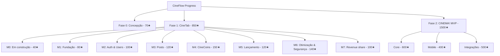
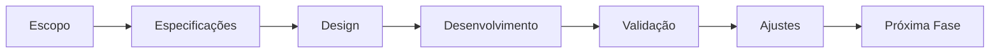
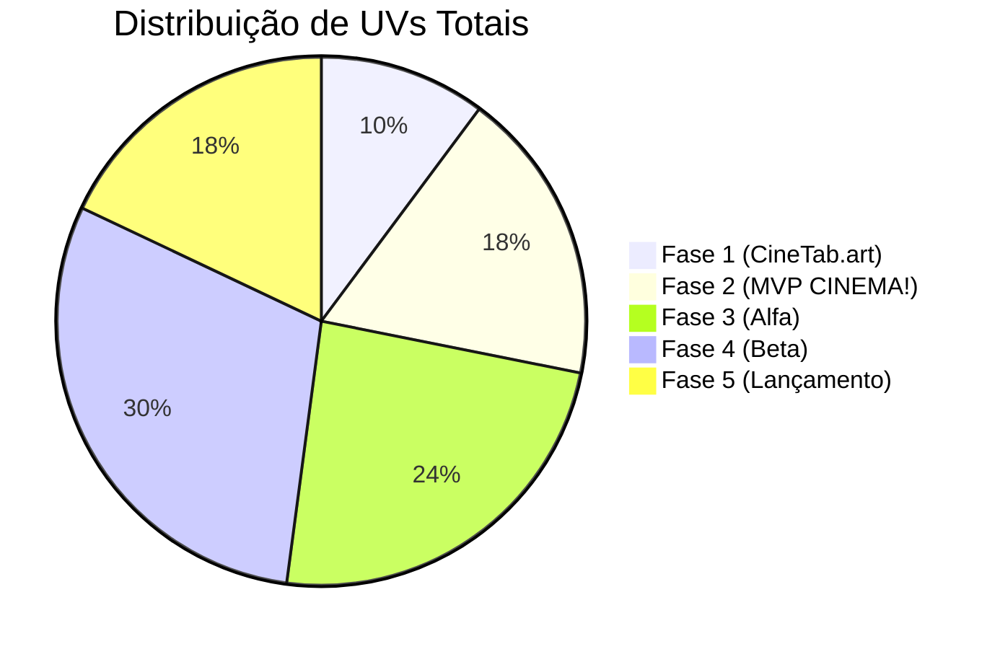

# Planejamento do Projeto: [[CINEMA!]]

## 🌐 Visão Geral
- **Descrição:** [Uma breve descrição do seu projeto de software]
- **Objetivo Principal:** [O problema que seu software resolve]
- **Público-Alvo:** [Quem são os usuários principais]
- **Proposta de Valor:** [O que diferencia seu software da concorrência]

## 📝 Meta-Informações
- **Data de Início:** 02-04-2025
- **Prazo Estimado para MVP:** Indefinido
- **Prazo Estimado para V1.0:** Sem perspectiva
- **Responsável Principal:** Troli
- **Repositório:** [CineTab](https://github.com/DevTroli/CineTab.art) &  futuramente projeto CINEMA!
- **Documentação Técnica:** [[DOCS TECNICA CINEMA!]] & [Documentação CineTab](https://github.com/DevTroli/CineTab.art/blob/main/README.md)

---
## Progressão CineFlow & CineScale
## CineFlow:

### Progresso Organico com [[CineScale]] 
![[CineScale#O que é o CineScale?##]]

## Resumo do planejamento do projeto 
1. **Pré-MVP: CineTab  (4 meses)**:  
   - Lançar versão básica com posts, comentários e sistema de CineCoins. 
2. MVP: CINEMA! (6 Meses)
  - lançar Web & app do conceito da aplicação CINEMA 
3. **Fase 2 (6 meses)**:  
   - Integrar API do TMDb para autocompletar dados de filmes.  
4. **Fase 3 (12 meses)**:  
   - Parcerias com festivais nacionais (ex: Festival de Gramado).  

> **Próximos Passos**:  
> - Validar MVP com micro-influencers de cinema.
> - Refinar o sistema de CineCoins para recompensar contribuições técnicas (ex: tutoriais de roteiro).  

# 🚀 Fase 0:  Planejamentos Iniciais (70★)

## Análise de Mercado ( 15★ )
- [x] Pesquisa de concorrentes diretos e indiretos ( 7★)
- [x] Identificação de diferencias no mercado ( 8★ )

## Idealização ( 15★ )
- [x] Posicionamento Estratégico ( 5★ )
- [x] Priorização inicial (MoSCoW: Must, Should, Could, Won't) ( 5★)
- [x] Esboço do modelo de negócio ( 5★ )

## Proposta de Valor ( 15★ )
- [x] Fazer Analise SWOT [Forças, Fraquezas, Oportunidades e Ameaças] (8 ★)
- [x] Perfil dos usuários [Tarefas, dores e ganhos] ( 7★ )

## Passos Iniciais (10★)
- [x] Definição da stack tecnológica preliminar
- [x] Estimativa macro de recursos necessários
- [x] Definição de milestones principais
## Definição do Escopo do CineTab.art (15★)
- [x] Definir a estrutura inicial do projeto no GitHub
- [x] Realizar um [[Issue Inception]]
- [x] Constituir as diretrizes e filosofias do projeto
### [Opcional] Design
- [ ] Wireframes das telas principais
- [ ] Design system minimalista
- [ ] Protótipo de baixa fidelidade

---
# 📊 Fase 1: cinetab.art (850★)

## Desenvolvimento (700★)
- [ ] [Milestone 0: Em construção (40★)](https://github.com/DevTroli/CineTab.art/milestone/1)
  - [x] Prettier (5★)
  - [x] EditorConfig (4★)
  - [ ] Domínio .com.br (6★)
  - [ ] Programar pagina "Em construção" (20★)
  - [x] Estilização código (15★)

- [ ] Milestone 1: Fundação (80★)
  - [ ] Setup DB (25★)
  - [ ] API Core (35★)
  - [ ] Deploy inicial (20★)

- [ ] Milestone 2: Auth & Users (100★)
  - [ ] Sistema login (40★)
  - [ ] Perfil usuário (30★)
  - [ ] Moderação (30★)

- [ ] Milestone 3: Post Notícias, Comentários (120★)
  - [ ] Sistema de posts (45★)
  - [ ] Comentários hierárquicos (35★)
  - [ ] Moderação conteúdo (25★)
  - [ ] Markdown support (15★)

- [ ] Milestone 4: TabCoins (& TabCash) (150★)
  - [ ] Sistema de reputação (50★)
  - [ ] Economia virtual (40★)
  - [ ] Transações P2P (35★)
  - [ ] Anti-abuso (25★)

- [ ] Milestone 5: Lançamento (120★)
  - [ ] Deploy final (30★)
  - [ ] Monitoramento (25★)
  - [ ] Docs usuário (35★)
  - [ ] Campanha inicial (30★)

- [ ] Milestone 6: Performance & Segurança (140★)
  - [ ] Otimização DB (40★)
  - [ ] Cache layer (35★)
  - [ ] SSL/TLS (25★)
  - [ ] Penetration test (40★)

- [ ] Milestone 7: Revenue Share (100★)
  - [ ] Sistema premium (45★)
  - [ ] Pagamentos (35★)
  - [ ] Revenue tracking (20★)

## Validação (150★)
- [ ] Testes internos (50★)
- [ ] Feedback beta (60★)
- [ ] Métricas (40★)

# 📊 Fase 2: MVP CINEMA! (1500★)
### Diagrama de Dependências

---
## Definição do Escopo (180★)
- [ ] Lista de funcionalidades core (60★)
- [ ] Critérios de sucesso (40★)
- [ ] Jornada do usuário (50★)
- [ ] Análise de riscos (30★)

## Especificações Técnicas (220★)
- [ ] Arquitetura simplificada (80★)
- [ ] Stack tecnológica (70★)
- [ ] Requisitos de integração (50★)
- [ ] Plano de escalabilidade (20★)

## Design (200★)
- [ ] Wireframes principais (70★)
- [ ] Design system (80★)
- [ ] Protótipo baixa fidelidade (50★)

## Desenvolvimento (800★)
- [ ] Setup ambiente (50★)
- [ ] Implementação core (400★)
  - [ ] Catálogo filmes (100★)
  - [ ] Sistema avaliação (80★)
  - [ ] Listas personalizadas (120★)
  - [ ] Social features (100★)
- [ ] Testes básicos (150★)
- [ ] CI/CD pipeline (100★)
- [ ] Documentação técnica (100★)

## Validação (150★)
- [ ] Testes internos (60★)
- [ ] Feedback beta (50★)
- [ ] Métricas avaliação (30★)
- [ ] Docs aprendizados (10★)

## Ajustes (150★)
- [ ] Priorização ajustes (40★)
- [ ] Implementação correções (80★)
- [ ] Reavaliação escopo (30★)

# 🌱 Fase 3: Versão Alfa (2000★)

## Evolução de Funcionalidades (300★)
- [ ] Análise feedback MVP (100★)
- [ ] Priorização novas features (120★)
- [ ] Refinamento UX (80★)

## Especificações Técnicas (400★)
- [ ] Refatoração arquitetura (150★)
- [ ] Expansão infra (120★)
- [ ] Monitoramento básico (80★)
- [ ] Sistema de logs (50★)

## Design (300★)
- [ ] Design system completo (120★)
- [ ] Protótipos alta fidelidade (100★)
- [ ] Testes usabilidade (80★)

## Desenvolvimento (800★)
- [ ] Novas funcionalidades (400★)
- [ ] Otimização performance (200★)
- [ ] Cobertura testes (200★)

## Validação (300★)
- [ ] Testes grupo expandido (120★)
- [ ] Análise métricas (100★)
- [ ] Satisfação usuários (80★)

## Documentação (200★)
- [ ] Docs técnica atualizada (80★)
- [ ] Docs usuário (70★)
- [ ] Prep expansão (50★)

---

# 🚀 Fase 4: Versão Beta (2500★)

## Expansão Funcionalidades (500★)
- [ ] Features secundárias (200★)
- [ ] Melhorias existentes (150★)
- [ ] Integrações externas (150★)

## Especificações Técnicas (600★)
- [ ] Escalabilidade (200★)
- [ ] Segurança (180★)
- [ ] Monitoramento completo (120★)
- [ ] Disaster recovery (100★)

## Experiência do Usuário (400★)
- [ ] Refinamento UI/UX (150★)
- [ ] Acessibilidade (120★)
- [ ] Otimização fluxos (130★)

## Desenvolvimento (900★)
- [ ] Features completas (400★)
- [ ] Testes extensivos (300★)
- [ ] Otimização carga (200★)

## Validação (300★)
- [ ] Programa beta real (120★)
- [ ] Coleta feedback (100★)
- [ ] Métricas negócio (80★)

## Preparação Lançamento (300★)
- [ ] Plano marketing (120★)
- [ ] Docs completa (100★)
- [ ] Suporte usuário (80★)

---

# 🎯 Fase 5: Versão 1.0 (1500★)

## Finalização Produto (400★)
- [ ] Ajustes finais (150★)
- [ ] Polimento UI/UX (120★)
- [ ] Testes finais (130★)

## Infraestrutura (500★)
- [ ] Config produção (150★)
- [ ] Backup strategy (120★)
- [ ] Monitoramento (130★)
- [ ] CDN global (100★)

## Lançamento (300★)
- [ ] Execução marketing (120★)
- [ ] Onboarding (100★)
- [ ] Suporte pós-lançamento (80★)

## Análise Pós-Lançamento (300★)
- [ ] Monitoramento métricas (120★)
- [ ] Feedback contínuo (100★)
- [ ] Identificação problemas (80★)

## Manutenção (200★)
- [ ] Roadmap futuro (80★)
- [ ] Ciclos melhoria (70★)
- [ ] Cadência releases (50★)

### Visão Geral de Progresso

---

# 📈 Gestão e Acompanhamento Contínuo

## Gestão de Projeto
- Metodologia: [Ágil/Scrum/Kanban/outro]
- Ferramentas: [Jira/Trello/GitHub/outro]
- Cadência de Reuniões: [Daily, retrospectivas, planejamentos]

## Monitoramento de Métricas
- **Métricas de Produto:**
  - [Taxa de retenção, Tempo de uso, etc.]
- **Métricas de Desenvolvimento:**
  - [Velocidade do time, Bugs por release, etc.]
- **Métricas de Negócio:**
  - [CAC, LTV, MRR, etc.]

## Gestão de Riscos
- Identificação proativa de riscos
- Planos de mitigação
- Registro de lições aprendidas

---
## Recursos de Aprendizado
- Artigos e estudos relevantes
- Cursos e treinamentos
