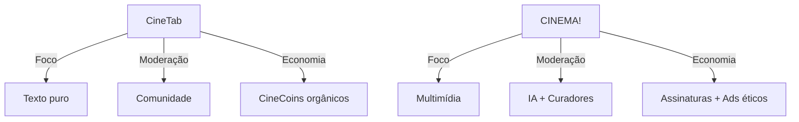

**Diferenças Essenciais Entre CineTab e CINEMA!**  
*(Mantendo a Mesma Filosofia Radical, Com Propósitos Complementares)*  

---

### **1.1 Diferenças Fundamentais**  
| **CineTab.art.br**                                                     | **CINEMA!**                                                           |
| ---------------------------------------------------------------------- | --------------------------------------------------------------------- |
| **"O Bastião da Palavra Livre"**                                       | **"O Hub Cinematográfico"**                                           |
| Fórum de **debates brutos**, mas orgânicos sobre cinema, sem adornos.  | Rede social **verticalizada** para experiências imersivas e dinâmicas |
| *Analogia*: Um boteco onde cinéfilos discutem com caneta e guardanapo. | *Analogia*: Um cineclube moderno com programação curada.              |

### 1.2 Comparação Técnica


### **1.3 Arquitetura da Experiência**  

#### **CineTab (Descentralizado)**  
- **Fluxo de uso**:  
  ```mermaid  
  graph LR  
    A[Postagem] --> B[Debate Textual]  
    B --> C[Conclusões Orgânicas]  
  ```  
- **Características Únicas**:  
  - *Posts são efêmeros*: O valor está no diálogo, não no arquivo.
  - *Sem perfis*: Destaque para ideias, não para personalidades.

#### **CINEMA! (Integrado)**  
- **Fluxo**:  
  ```mermaid  
  graph LR  
    A[Filme] --> B[Análise Multimídia]  
    B --> C[Eventos / Dilemicas]  
    C --> D[Comunidade Persistente]  
  ```  
- **Características Únicas**:  
  - *Perfis ricos*: Filmografias pessoais, listas temáticas.
  - *Timeline inteligente*: Ordenada por relevância cultural, não algoritmos.  

---

### **3. Moderação & Governança**  
| **CineTab**                                  | **CINEMA!**                               |
| -------------------------------------------- | ----------------------------------------- |
| **Autogestão orgânica**:                     | **Curadoria híbrida**:                    |
| - Comunidade se auto-modera na plataforma    | - IA detecta toxicidade                   |
| - Karma (XP) invisível                       | - Curadores humanos validam               |
| *Por quê?*: Confiança na sabedoria das ruas. | *Por quê?*: Escalabilidade com qualidade. |

---

### **4. Economia da Atenção**  
| **CineTab**                                                   | **CINEMA!**                                     |
| ------------------------------------------------------------- | ----------------------------------------------- |
| **CineCoins como moeda social**:                              | **Assinaturas premium**:                        |
| - Ganhos por contribuição                                     | - Conteúdo exclusivo (ex: aulas de direção)     |
| - Gastos em visibilidade                                      | - Sem anúncios tradicionais                     |
| *Filosofia*: Valor gerado pela comunidade, para a comunidade. | *Filosofia*: Sustentabilidade sem vender dados. |

---

### **5. Exemplos Concretos**  
#### **Cenário no CineTab:**  
- *Post*: **"Por que o final de 'Inception' é sobre paternidade?"**  
  - 15 comentários em markdown.  
  - 8 CineCoins para o autor.  

#### **Cenário no CINEMA!:**  
- *Experiência*: **"Desconstruindo 'Inception'"**  
  - Live com um neurocientista ou Dinâmicas interativas com a comunidade da plataforma sobre a obra 
  - Galeria de storyboards interativos.  
  - Thread de posts sobre teorias.  

---

### **6. Riscos & Mitigações**  
| **Desafio**          | **CineTab**                                               | **CINEMA!**                                               |
| -------------------- | --------------------------------------------------------- | --------------------------------------------------------- |
| **Elitização**       | Limitar debates técnicos a tags específicas & gatekeeping | Camada free robusta para evitar exclusão entre PRO e Free |
| **Dispersão**        | Manter foco em texto puro e leitura ativa                 | Navegação por "temas atemporais" (ex: amor, morte).       |
| **Sustentabilidade** | Doações voluntárias + merch.                              | Assinaturas + patrocínios culturais.                      |
#### Risco de Confusão
- CineTab deve manter **pureza textual** para não virar o "rascunho do CINEMA!"
- CINEMA! precisa evitar de não se tornar **mais uma rede social genérica** como qualquer outra

---

### **Conclusão: Dois Lados da Mesma Moeda**  
```markdown  
> "O CineTab preserva o cinema como **arte conversada**.  
> O CINEMA! o celebra como **arte vivida**."  
```  

**Sinergia Planejada**:  
- *Cross-pollination*: Debates do CineTab viram eventos no CINEMA!.  
- *Economia compartilhada*: CineCoins podem desbloquear conteúdos no CINEMA!.  

Ambos combatem a **commoditização do cinema**, mas com armas diferentes: um com **texto cru**, outro com **experiência imersiva**.