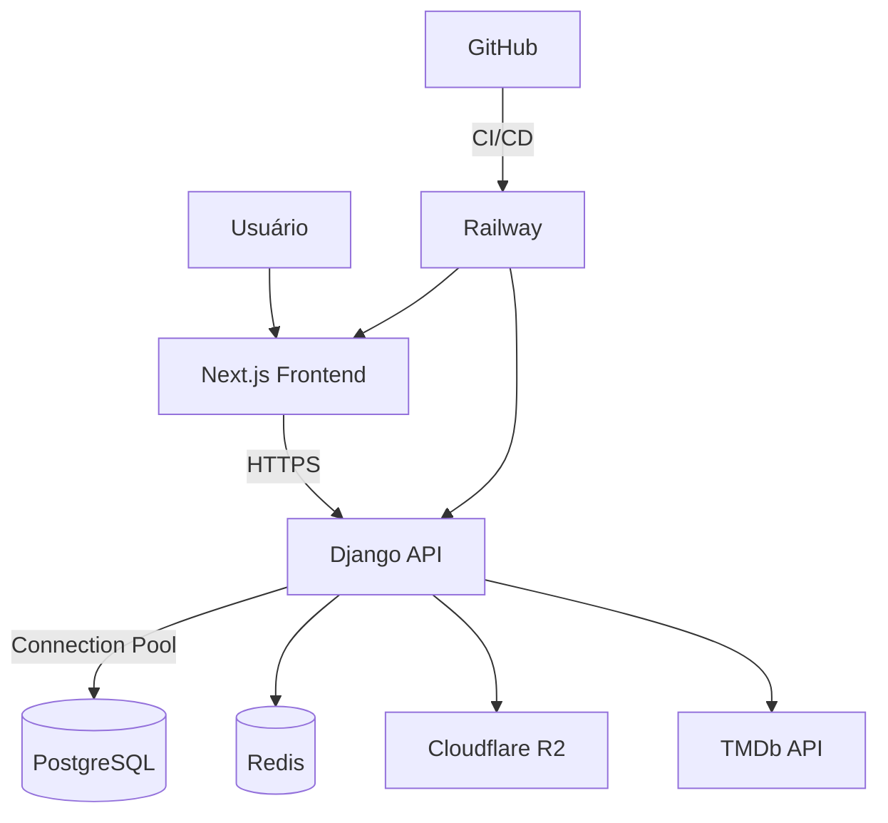

# Plano de desenvolvimento

#### Stack Moderna: Next.js (JavaScript) no frontend + Django/DRF no backend.  

## 🌐 Visão da Arquitetura com Railway


- **Separação Clara**: Frontend (Next.js) nunca acessa o banco diretamente – tudo via API.
- **Proteção contra Injeções**: Django ORM sanitiza queries + validação estrita no DRF.

---
## 🛠️ Componentes Técnicos

| Serviço              | Configuração Railway                              | Propósito                                  |
|----------------------|---------------------------------------------------|--------------------------------------------|
| **Django API**       | Dockerfile (Python 3.11 + Gunicorn)              | Hospedagem API + Workers Celery           |
| **Next.js**          | Static Web (Build Command: `next build`)         | Frontend otimizado com SSR                |
| **PostgreSQL**       | Railway PostgreSQL Add-on                        | Banco principal (15GB free tier)          |
| **Redis**            | Railway Redis Add-on                             | Cache de sessões e filas                  |
| **Storage**          | Cloudflare R2 via S3 API                         | Uploads de mídia (100GB free)             |


## 🗂️ Estrutura do Projeto

### Backend (Django)
```bash
backend/
├── core/                  # Configurações do projeto
├── users/                 # App de usuários
│   ├── models.py          # CustomUser, UserProfile
│   ├── api/               # Endpoints DRF (registro, perfil)
│   └── permissions.py     # Controle de acesso
├── movies/                # App de filmes
│   ├── models.py          # Movie, Review, List
│   ├── tasks.py           # Tarefas Celery (ex: atualizar filmes)
│   └── api/               # Viewsets DRF
├── social/                # Interações sociais
│   ├── models.py          # Follow, Like, Activity
│   └── api/               # Feed, followers
└── docker-compose.yml     # Serviços: PostgreSQL, Redis
```

### Frontend (Next.js)
```bash
frontend/
├── src/
│   ├── pages/             # Rotas Next.js
│   │   ├── api/           # API Routes (proxies para Django API)
│   │   ├── login.js       # Página de login
│   │   └── profile/[id].js # Perfil dinâmico
│   ├── components/        # Reutilizáveis (Header, MovieCard)
│   ├── lib/               # Cliente HTTP (axios, fetch)
│   └── styles/            # CSS modules ou Tailwind
├── next.config.js         # Configuração CORS/Env
└── Dockerfile             # Build otimizado
```

## 🔄 Workflow CI/CD com Railway
### GitHub Actions Pipeline
```yaml
name: Deploy to Railway

on:
  push:
    branches: [main]

jobs:
  deploy:
    runs-on: ubuntu-latest
    steps:
      - uses: actions/checkout@v3
      
      # Backend
      - name: Deploy Django
        uses: railwayapp/action@v1.3.0
        with:
          service: backend
          environment: production
          token: ${{ secrets.RAILWAY_TOKEN }}
          command: |
            python manage.py migrate
            python manage.py collectstatic --noinput
            
      # Frontend
      - name: Deploy Next.js
        uses: railwayapp/action@v1.3.0
        with:
          service: frontend
          environment: production
          token: ${{ secrets.RAILWAY_TOKEN }}
```

### 📈 Métricas de Custo (Estimativa)
| Recurso        | Free Tier     | Scale (50k usuários) |
| -------------- | ------------- | -------------------- |
| **API Django** | 500 horas/mês | $0.10/hora           |
| **PostgreSQL** | 1GB storage   | $7/GB                |
| **Redis**      | 256MB         | $0.50/GB-hora        |
| **Bandwidth**  | 100GB/mês     | $0.10/GB adicional   |

#### 🔒 Modelo de Segurança na Railway
| Camada               | Implementação                                      | Railway Feature                    |
|----------------------|---------------------------------------------------|------------------------------------|
| **Isolamento**       | Cada serviço em container separado               | Network Isolation                  |
| **Secrets**          | Variáveis injetadas no runtime                   | Secret Management                  |
| **Backups**          | Snapshots diários do PostgreSQL                  | Automatic Backups                  |
| **HTTPS**            | Certificado SSL automático                       | Edge TLS                           |
| **Rate Limiting**    | 100 reqs/segundo por IP (Web Application Firewall)| WAF Integrado                      |

---

## 📅 Detalhes do (suposto) desenvolvimento

### Sprint 1: Core do Backend
**Objetivo**: API Django funcional seguindo a filosofia API first.
```python
# users/api/serializers.py
class UserSerializer(serializers.ModelSerializer):
    class Meta:
        model = CustomUser
        fields = ('id', 'email', 'name')
        extra_kwargs = {'password': {'write_only': True}}
```
**Entregáveis**:
- Modelos `User`, `Movie`, `Review`.
- Endpoints DRF: `/api/auth/login/`, `/api/movies/`.

### Sprint 2: Integração TMDb + Frontend Básico
**Objetivo**: Busca de filmes via API externa e exibição no Next.js.
```javascript
// frontend/src/pages/movies.js
export async function getServerSideProps() {
  const res = await fetch('http://backend/api/movies/');
  const movies = await res.json();
  return { props: { movies } };
}
```
**Entregáveis**:
- Serviço Django para sincronizar filmes do TMDb.
- Página Next.js com listagem de filmes (SSR).

### Sprint 3: Sistema Social
**Objetivo**: Feed de atividades e interações em tempo real.
```python
# social/models.py
class Activity(models.Model):
    user = models.ForeignKey(User, on_delete=models.CASCADE)
    verb = models.CharField(max_length=100)  # Ex: "reviewed", "followed"
    target_id = models.PositiveIntegerField()  # ID do filme/usuário relacionado
```
**Entregáveis**:
- Modelo `Activity` e endpoint `/api/feed/`.
- Página Next.js com scroll infinito (client-side fetching via `SWR`).

### Sprint 4: API de Parceiros + Segurança
**Objetivo**: Endpoints documentados e seguros para parceiros.
```python
# movies/api/permissions.py
class PartnerAccessPermission(permissions.BasePermission):
    def has_permission(self, request, view):
        return request.user.groups.filter(name='Parceiros').exists()
```
**Entregáveis**:
- Documentação Swagger em `/api/docs/`.
- Rate limiting (ex: 100 requests/hora para parceiros).

### Sprint 5: Deploy & Otimização (Semana 8)
**Objetivo**: CI/CD e infra escalável.
```yaml
# .github/workflows/deploy.yml
jobs:
  deploy_backend:
    runs-on: ubuntu-latest
    steps:
      - uses: actions/checkout@v3
      - run: docker-compose -f backend/docker-compose.prod.yml up -d
  deploy_frontend:
    runs-on: ubuntu-latest
    steps:
      - uses: actions/checkout@v3
      - run: vercel --prod --token ${{ secrets.VERCEL_TOKEN }}
```
**Entregáveis**:
- Docker-compose para produção (Nginx, Gunicorn).
- Deploy automático no Vercel (frontend) e AWS ECS (backend).

---

## 🔒 Configuração de Segurança
### Backend (Django)
```python
# settings.py
CORS_ALLOWED_ORIGINS = ['https://seusite.com']  # Somente frontend
CSRF_COOKIE_HTTPONLY = True
SESSION_COOKIE_SECURE = True

# Validação de dados (exemplo)
class MovieSerializer(serializers.ModelSerializer):
    def validate_rating(self, value):
        if not (1 <= value <= 5):
            raise serializers.ValidationError("Rating must be between 1-5.")
        return value
```

### Frontend (Next.js)
```javascript
// next.config.js
module.exports = {
  async rewrites() {
    return [
      {
        source: '/api/:path*',
        destination: 'http://backend:8000/api/:path*', // Proxy reverso
      },
    ];
  },
};
```

---

## 🐳 Deploy com Docker
### Backend
```dockerfile
# backend/Dockerfile.prod
FROM python:3.11-slim
RUN pip install gunicorn
COPY . /app
WORKDIR /app
RUN pip install -r requirements.txt
CMD ["gunicorn", "--bind", "0.0.0.0:8000", "core.wsgi"]
```

### Frontend
```dockerfile
# frontend/Dockerfile
FROM node:18-alpine
RUN npm install -g next
COPY . /app
WORKDIR /app
RUN npm install
RUN npm run build
CMD ["npm", "start"]
```

## 💡 Otimização do DevOPS
1. **Cold Starts**:
   - Configurar `min_instances=1` no `railway.json` para manter API ativa
   ```json
   {
     "builds": [
       {
         "src": "src/core/asgi.py",
         "use": "@railway/django",
         "min_instances": 1
       }
     ]
   }
   ```

2. **Cache de Assets**:
   ```nginx
   # Dockerfile.railway (Frontend)
   FROM node:18-alpine AS builder
   RUN npm install -g next
   COPY . .
   RUN npm run build
   
   FROM railway/static:latest
   COPY --from=builder /app/.next/static ./.next/static
   ```

3. **Monitoramento**:
   ```bash
   railway logs --follow
   railway metrics
   ```

---

## ❓ FAQ

### **Como garantir que o frontend não acessa o DB?**
- **Resposta**: O Next.js só se comunica com o backend via APIs REST. Credenciais do DB existem apenas no ambiente Django.

### **Como escalar para milhões de usuários?**
- **Estratégia**:
  1. Cache de consultas com Redis (ex: feed de atividades).
  2. Balanceamento de carga no Django (Kubernetes + Gunicorn workers).
  3. CDN para assets estáticos (Vercel já faz isso automaticamente).

### **Alternativas ao JWT?**
- Use **OAuth2** (ex: Django OAuth Toolkit) para parceiros, mas JWT é mais leve para auth básica.

### Notas Finais
- **Boas Práticas**:  
  - **Django**: Use `select_related` e `prefetch_related` para otimizar queries.  
  - **Next.js**: Pré-renderize páginas públicas com `getStaticProps` para performance.  
  - **Segurança**: Sempre use `parameterized queries` no Django e valide inputs no DRF.  