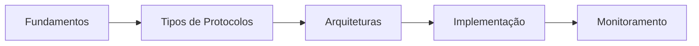

## 🚀 Fundamentos

- [[REST API]] - Entendendo interfaces de programação de aplicações RESTful
- [[Protocolos de rede]] - Visão geral dos principais protocolos de comunicação
- [[Client -> Servidor]] - Arquitetura fundamental da comunicação em rede

## 📡 Tipos de Protocolos

- [[Protocolos TCP/IP]] - A base da internet moderna
- [[Protocolos HTTP/HTTPS]] - Comunicação na web e segurança
- [[Protocolos de Mensageria]] - MQ, AMQP, MQTT e outros

## 🔄 Arquiteturas de Comunicação

- [[Arquitetura RESTful]] - Princípios e implementação
- [[Arquitetura GraphQL]] - Consultas flexíveis e eficientes
- [[Arquitetura WebSockets]] - Comunicação bidirecional em tempo real

## 🛠️ Implementação e Boas Práticas

- [[Design de APIs]] - Estruturando interfaces programáticas
- [[Segurança em APIs]] - Autenticação, autorização e proteção de dados
- [[API Versioning]] - Estratégias para evolução de APIs

## 📊 Monitoramento e Desempenho

- [[API Logging]] - Registrando comportamentos e erros
- [[API Rate Limiting]] - Controlando taxa de requisições
- [[API Caching]] - Otimizando performance e responsividade

## 🧩 Fluxo de Conhecimento

## 📚 Artigos Recomendados

- [[REST vs SOAP]] - Comparando abordagens de arquitetura
- [[Construindo APIs Escaláveis]] - Estratégias para crescimento
- [[Microsserviços e APIs]] - Integrando componentes distribuídos