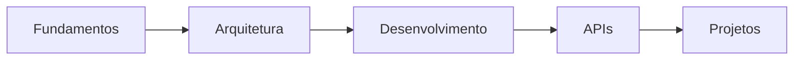

# Meus artigos
- 

## 🌟 Introdução ao Django
- [[WHY DJANGO?]] - Motivações e vantagens do framework
- [[UNDERSTAND DJANGO BASICS]] - Fundamentos essenciais para começar
- [[DJANGO HISTORY]] - Origem e evolução do framework

## 🏗️ Arquitetura e Estrutura
- [[DJANGO ARCHTECTURE MTV]] - Entendendo o Model-Template-View
- [[PROJECT STRUCTURE DJANGO]] - Organizando projetos Django de forma eficiente
- [[DJANGO VIRTUAL ENVIRONMENT]] - Gerenciamento de ambientes de desenvolvimento

## 🔬 Aprofundamento Técnico
- [[DEEP DIVE INTO DJANGO]] - Explorando recursos avançados
- [[DJANGO REST (API FRAMEWORK)]] - Criação de APIs robustas
- [[SECURITY IN DJANGO]] - Práticas de segurança e proteção

## 📍 Guia de Aprendizado
- [[ROAD MAPS DJANGO]] - Caminho de aprendizado e desenvolvimento

## 🧩 Fluxo de Conhecimento

