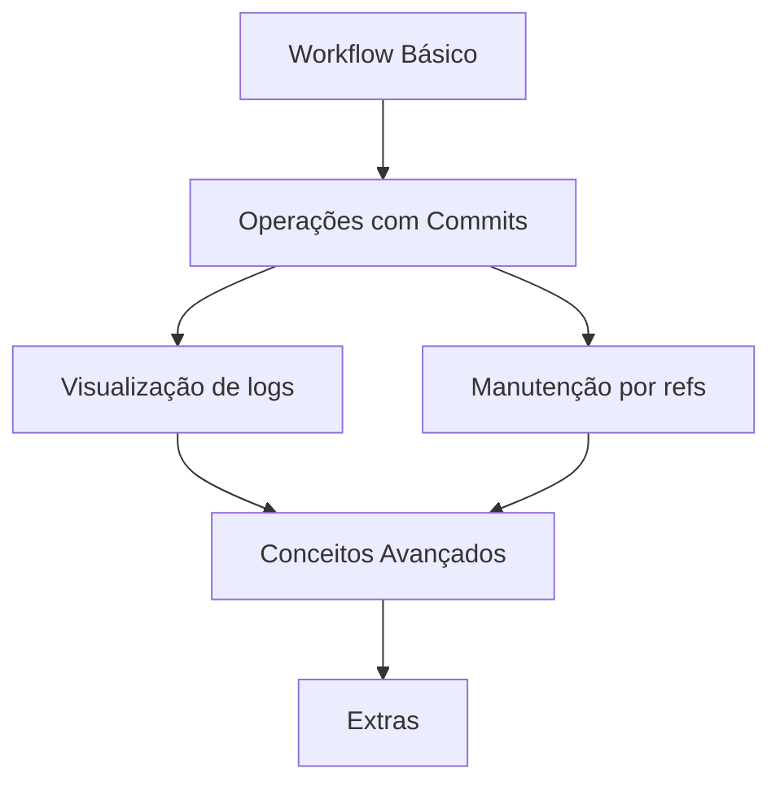

# Meus artigos
- [[Pull Request - how to be good]]
- [[THE RISE OF GIT]]

# 🤝Workflow Básico
- [[GIT WORKFLOW]] (Entenda o fluxo de trabalho básico e boas práticas no Git)
- [[PULL REQUEST]] (Como colaborar e revisar código utilizando pull requests)

## 🔄 Operações com commits
- [[GIT RESET, REVERT & CHECKOUT]] (Diferenças entre reset, revert e checkout)
- [[GIT - SQUASH COMMITS INTO ONE COMMIT]] (Combinar múltiplos commits em 1 )
- [[SEMANTIC COMMIT]] (Como fazer bons commits e como usar emojis neles)

## 🔍Visualização & Navegação
- [[GIT REFS]] (O que são e como funcionam as referências no Git)
- [[GIT DIFF]] (Vendo a diferença entre os commits pela diferença deles)
- [[GIT REFLOG]] (Recuperando referências perdidas com o git reflog)
- [[GIT LOG]] (Comandos para visualizar o histórico de commits)

## 🧹Manutenção de Repositórios
- [[GIT LFS]] (Armazenamento de arquivos grandes utilizando Git Large File Storage)
- [[GIT GC]] (Gerenciamento e limpeza do repositório com git gc)

## 🛠️ Conceitos Avançados
- [[GIT - Plumbing & Porcelain]] (Entendendo os níveis de comandos do Git)

# 🌟 Extras
- [[GIST]] (Compartilhamento de snippets e pequenas porções de código)

## 🧩 Fluxo de Conhecimento

