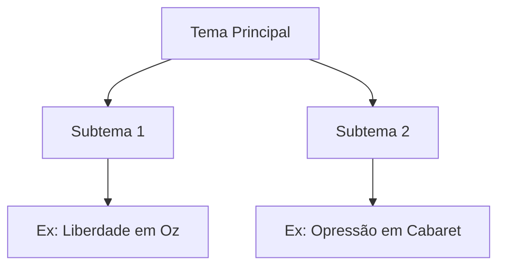

# {{Título do Filme}}  
**Gênero:** {{Musical/Drama/Comédia/etc.}}  
**Ano:** {{Ano}} | **Diretor(a):** {{Nome}}  
**Tags:** #cinema #musical #{{subgênero}} #contexto-histórico  #analise

---

## Metadados Básicos  
- **País de Origem:** {{País}}  
- **Duração:** {{XhYm}}  
- **Prêmios Relevantes:** {{Oscar, Cannes, etc.}}  
- **Fonte de Inspiração:** {{Peça teatral, livro, evento real}}  

---

## Elementos-Chave para Análise  
### 1. **Narrativa e Estrutura**  
- **Arco do Personagem Principal:**  
  - Exemplo (The Wizard of Oz): "Dorothy busca voltar para casa, mas descobre seu próprio poder."  
  - {{Descreva o conflito central e transformação}}  

- **Uso da Música/Canções (Para Musicais):**  
  - {{Como as músicas avançam a trama? Ex: "Over the Rainbow" como desejo de fuga}}  
  - {{Função dos números musicais: caracterização, crítica social, etc.}}  

### 2. **Estética Visual**  
- **Paleta de Cores:**  
  - Exemplo (Cabaret): "Cores berrantes no cabaré contrastam com tons sombrios das ruas nazistas."  
  - {{Analise simbologia das cores}}  

- **Cenografia e Figurino:**  
  - {{Como ambientes refletem temas? Ex: Kansas (preto e branco) vs. Oz (Technicolor)}}  

### 3. **Técnicas Cinematográficas**  
- **Movimentos de Câmera:**  
  - Exemplo (Singin' in the Rain): "Planos abertos na cena da chuva enfatizam liberdade."  
  - {{Ângulos, enquadramentos e transições relevantes}}  

- **Edição e Ritmo:**  
  - {{Ex: Cortes rápidos em Moulin Rouge! para criar frenesi}}  

---

## Análise Contextual  
### 1. **Contexto Histórico-Social**  
- {{Como o filme reflete/dialoga com sua época? Ex: The Wizard of Oz e a Grande Depressão}}  

### 2. **Influências Artísticas**  
- {{Referências a pinturas, teatro, literatura. Ex: An American in Paris e impressionismo}}  

### 3. **Legado e Crítica**  
- {{Recepção na época vs. atual. Ex: West Side Story como crítica à xenofobia}}  

---

## Perspectivas Críticas  
### 1. **Pontos Fortes**  
- {{Inovação técnica, profundidade temática, atuações}}  

### 2. **Controvérsias/Limitações**  
- {{Ex: Representação de gênero em Seven Brides for Seven Brothers}}  

### 3. **Sua Opinião**  
- {{O que funcionou/não funcionou para você?}}  

---

## Conexões e Comparações  
### 1. **Filmes Similares**  
| Elemento           | {{Este Filme}}       | {{Outro Filme}}        |  
|--------------------|----------------------|------------------------|  
| Uso da Cor         | {{Ex: Verde para inveja}} | {{Ex: Vermelho para paixão}} |  
| Representação Social | {{Ex: Crítica ao nazismo}} | {{Ex: Denúncia da pobreza}} |  

### 2. **Diagrama de Temas**  


---

## Atividades Práticas  
1. **Análise de Cena:**  
   - {{Escolha uma cena e descreva como luz, som e movimento transmitem emoção}}  

2. **Exercício Criativo:**  
   - {{Reimagine o final do filme em outro gênero (ex: musical como thriller)}}  

---

## Recursos Adicionais  
- **Livros/Artigos:** {{Títulos sobre teoria cinematográfica}}  
- **Documentários:** {{Making-of, entrevistas com o diretor}}  
- **Filmes Relacionados:** {{Lista de obras influenciadas}}  

### **Como Usar o Template:**  
1. **Substitua `{{...}}`** por suas análises.  
2. **Adapte Seções:** Para outros gêneros, troque "Música" por "Efeitos Sonoros" (terror) ou "Diálogos" (drama).  
3. **Use Hyperlinks:** Linke filmes relacionados (NomeDoFilme) para criar uma rede de conhecimento.  
4. **Personalize Tags:** Inclua tags específicas (#ditadura, #fantasia) para filtrar por tema no Obsidian.  

---

**Exemplo Prático (The Wizard of Oz):**

```markdown  
# The Wizard of Oz  
**Gênero:** Musical/Fantasia  
**Ano:** 1939 | **Diretor:** Victor Fleming  
**Tags:** #technicolor #jornada-do-herói #GrandeDepressão  

## Elementos-Chave para Análise  
### 1. Narrativa e Estrutura  
- **Arco do Personagem Principal:**  
  "Dorothy busca voltar para casa, mas descobre que o poder esteve nela o tempo todo."  

### 2. Estética Visual  
- **Paleta de Cores:**  
  "Transição do Kansas (P&B) para Oz (Technicolor) simboliza a passagem da realidade para a fantasia."  
``` 