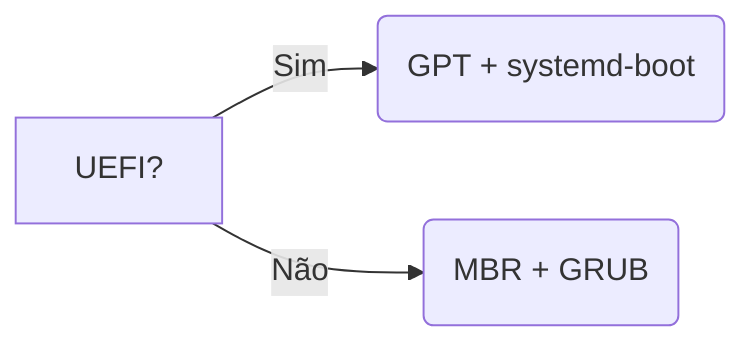
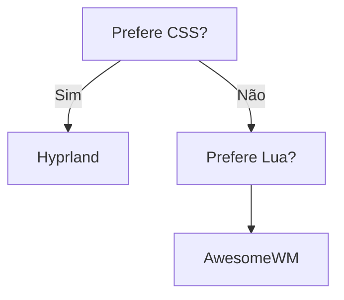

### **Do Arch Puro para um Arch Linux Personalizado**  
*(Estrutura Otimizada com Progressão Pedagógica, Links Obsidian e Rants Críticos)*  

---

## **Dia 1**: Filosofia e Fundamentos  
### [[O Caminho do Artesão]]  
**Por que instalar manualmente?**  
- Controle absoluto vs ilusão de facilidade em instaladores automáticos  
- Arquitetura transparente: você sabe onde cada peça está  
- "Se você não consegue reinstalar seu sistema em 1h, você não o controla"  

**Registro do Meu Setup Atual** (06/2024):  
```bash  
OS: Arch Linux + Hyprland  
Editor: Neovim (Lua config)  
Ferramentas:  
- MISE (versionamento universal)  
- Docker/Podman (containers)  
- ClipCat (clipboard inteligente)  
```  

### [[A Mentira do "Funciona na Minha Máquina"]] *(Rant)*  
> "Seu script 'automágico' esconde 47 dependências não documentadas. Arch manual te força a conhecer cada uma."  

**Checklist Inicial:**  
- [ ] Verificar hardware com `lspci | grep -i audio`  
- [ ] Criar mídia bootável com `dd` (não use Etcher)  
- [ ] Testar conexão: `ping archlinux.org`  

---

## **Dia 2**: Particionamento e Sistemas de Arquivos  
### [[GPT vs MBR: A Batalha dos Bootloaders]]  
**Fluxograma de Decisão:**  


### [[Btrfs: Seu Sistema Anti-Catástrofe]]  
**Por que é revolucionário:**  
- Snapshots automáticos com `snapper`  
- Compressão transparente (economiza 40% em SSD)  
- **Armadilha:** Não use com encryptação LUKS1  

**Comandos Cruciais:**  
```bash  
mkfs.btrfs -L ROOT /dev/nvme0n1p2  # -L é seu amigo  
btrfs subvolume create @home        # Isola home  
```  

---

## **Dia 3**: Sistema Base e Chroot  
### [[Chroot: Portal Dimensional]]  
> "`arch-chroot` não é um comando, é um ritual de passagem."  

**Erros Fatais:**  
1. Esquecer `genfstab -U /mnt >> /mnt/etc/fstab`  
2. Não configurar locale (`pt_BR.UTF-8` ou guerra cultural)  

**Pacotes Essenciais:**  
```bash  
pacstrap /mnt base linux linux-firmware intel-ucode  
# AMD? Troque por amd-ucode  
```  

---

## **Dia 4**: Bootloader e Segurança  
### [[GRUB é um Dinossauro]] *(Rant)*  
> "Systemd-boot carreza em 0.8s vs GRUB em 4s. Você realmente tem tempo a perder?"  

**Configuração Minimalista:**  
```ini  
# /boot/loader/entries/arch.conf  
title   Arch Linux  
linux   /vmlinuz-linux  
initrd  /initramfs-linux.img  
options root=UUID=... rw quiet  
```  

### [[Secure Boot: Teatro de Segurança]]  
Guia para desativar sem remorso em máquinas pessoais.  

---

## **Dia 5**: Rede e Bluetooth  
### [[NetworkManager vs iwd: A Guerra Inútil]]  
**Quando usar cada um:**  
| Ferramenta       | Prós                         | Contras                  |  
|------------------|-----------------------------|--------------------------|  
| NetworkManager   | Amigável para laptops       | Complexo para servidores |  
| iwd              | Leve e rápida               | Menos recursos           |  

**Bluetooth sem Magia:**  
```bash  
bluetoothctl  
power on  
agent on  
scan on  
trust [MAC]  
connect [MAC]  
```  

## **Dia 6**: Áudio e Drivers  
### [[PipeWire: O Assassino do PulseAudio]] *(🚀 Conceito Revolucionário)*  
**Por que mudar?**  
| Feature          | PulseAudio | PipeWire |  
|------------------|------------|----------|  
| Latência         | 50ms       | <5ms     |  
| Wayland Support  | Parcial     | Nativo   |  
| Vídeo            | Não        | Sim      |  

**Configuração Mínima Viável:**  
```bash
sudo pacman -S pipewire pipewire-pulse wireplumber pavucontrol
systemctl --user enable pipewire pipewire-pulse
```

⚠️ **Armadilha Comum:**  
> "Se seu áudio sumir após sleep, culpe o `wireplumber`. Solução:  
> ```bash 
> systemctl --user mask wireplumber
> systemctl --user enable pipewire-media-session
> ```"

### [[Drivers NVIDIA: O Pacto com o Diabo]] *(Rant Ácido)*  
> "Proprietários, mal documentados e quebram com updates. Prefira AMD ou Intel a menos que precise de CUDA."

---

## **Dia 7**: Interface Gráfica e Fontes  
### [[Hyprland vs AwesomeWM: Religião Técnica]]  
**Teste de 5 Segundos:**  


### [[A Grande Farsa das Fontes]] *(🤯 Deep Dive)*  
**Solução para Emojis Bugados:**  
```xml
<!-- ~/.config/fontconfig/fonts.conf -->
<match target="pattern">
  <test name="family"><string>monospace</string></test>
  <edit name="family" mode="prepend" binding="strong">
    <string>JetBrains Mono</string>
  </edit>
</match>
```

**Checklist Pós-Instalação:**  
- [ ] `fc-cache -fv` atualizou o cache?  
- [ ] `noto-fonts-emoji` instalado?  
- [ ] Teste com `echo -e "\U1F914"` (emoji 🤔)  

---

## **Dia 8**: Gerenciamento de Janelas  
### [[Waybar: Seu Painel de Controle]]  
**Configuração Matadora:**  
```css
/* ~/.config/waybar/mocha.css */
@define-color battery-critical #f38ba8;
@define-color network-disconnected #fab387;
```

**Dica Ocultada:**  
> "Use `custom/` modules para criar widgets com scripts Bash. Exemplo:  
> ```bash
> # Mostra temperatura da CPU
> sensors | grep Tdie | awk '{print $2}'
> ```"

### [[Rofi > Todos]] *(Rant Iconoclasta)*  
> "Dmenu é brinquedo de criança. Rofi faz café enquanto executa seus scripts SSH."

---

## **Dia 9**: Clipboard e Produtividade  
### [[ClipCat: Memória Expandida]]  
**Setup Anti-Frustração:**  
```bash
systemctl --user enable clipcatd
bind = $mod, V, exec, clipcat-menu
```

⚠️ **Problema Comum:**  
> "Wayland bloqueia acesso ao clipboard? Adicione:  
> ```ini
> [environment]
> GTK_USE_PORTAL=1
> ```"

### [[Yazi: O Ranger Moderno]]  
**Comparativo Cruel:**  
| Comando  | Ranger | Yazi |  
|----------|--------|------|  
| Preview  | Lento  | Instantâneo |  
| UI       | ASCII  | GUI-like |  
| Config   | Python | TOML |  

---

## **Dia 10**: Hardening e Segurança  
### [[Firewall: Não é Paranoia]]  
**Regras Essenciais com nftables:**  
```bash
nft add rule inet filter input tcp dport {22,80,443} accept
nft add rule inet filter input drop
```

### [[SELinux vs AppArmor: Falso Conflito]]  
> "AppArmor para desktops, SELinux para servidores. Próxima pergunta."

**Checklist de Segurança:**  
- [ ] `sudo` configurado sem senha para seu usuário?  
- [ ] Serviços desnecessários desativados? (`systemctl list-unit-files`)  
- [ ] Partições `/home` e `/tmp` com noexec?  

---

## **Dia 11**: Automação e Replicação  
### [[Ansible: Seu Exército de Clones]]  
**Playbook Básico:**  
```yaml
- hosts: localhost
  tasks:
    - name: Instalar pacotes essenciais
      pacman: name={{ item }} state=present
      with_items:
        - git
        - neovim
        - docker
```

### [[Btrfs Snapshots: Máquina do Tempo]]  
**Setup Automatizado:**  
```bash
# /etc/pacman.d/hooks/50-btrfs-snapshot.hook
[Trigger]
Operation = Upgrade
Type = Package
Target = *

[Action]
Description = Criando snapshot pré-update...
When = PreTransaction
Exec = /usr/bin/btrfs subvolume snapshot / /.snapshots/$(date +%Y-%m-%d_%H-%M)
```

**Checklist Final:**  
✅ Sistema reproduzível em 1h?  
✅ Todos os dots no Git?  
✅ Snapshots testados?  

> *"Seu Arch manual agora é um organismo autorreplicante. Parabéns, Dr. Frankenstein."*  

---

### **FAQ dos 7 Pecados Capitais** *(Erros Mais Comuns)*  
1. **Gula:** Instalar todos os pacotes AUR sem verificar dependências  
2. **Preguiça:** Não ler logs (`journalctl -xe`)  
3. **Soberba:** Achar que `sudo rm -rf /` nunca acontecerá com você  

---

### **Quiz Final: Você é um Mestre Arch?**  
1. Como recuperar um sistema que não boota após update do kernel?  
   - A) Chorar  
   - B) `chroot` via USB e rollback com pacman  
   - C) Reinstalar tudo  

2. Qual comando mostra todas as fontes carregadas para um caractere específico?  
   - A) `fc-match -v 'emoji'`  
   - B) `font-manager`  
   - C) `echo -e "\U1F4A9"`  

*(Respostas: 1-B, 2-A)*  

---

**Próximos Níveis:**  
- [ ] Guia "Arch para Devs" com Kubernetes e NixOS  
- [ ] Workshop de troubleshooting avançado  
- [ ] Livro "Filosofia do Controle Total"  

> *"Este Atlas não é um ponto final - é sua primeira alavanca para remodelar todo o ecossistema Linux à sua imagem."*