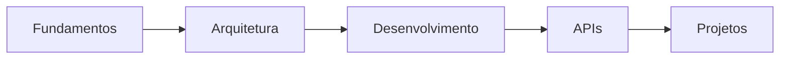

# Meus artigos
- 

## 🌟 Introdução ao Django
- [[DJ-BASICS]] - Fundamentos essenciais para começar
- [[DJ-CONTEXT]] -  Motivações, vantagens do framework, Origem e sua evolução.

## 🏗️ Arquitetura e Estrutura
- [[DJ-ARCHTECTURE]] - Entendendo o Model-Template-View (MTV)
- [[DJ-STRUCTURE]] - Organizando projetos Django de forma eficiente
- [[DJ-ENVDEV]] - Gerenciamento de ambientes de desenvolvimento

## 🔬 Aprofundamento Técnico
- [[DJ-ADVANCE]] - Explorando recursos avançados
- [[DJ-DRF]] - Criação de APIs robustas
- [[DJ-SECURITY]] - Práticas de segurança e proteção

## 📍 Guia de Aprendizado
- [[DJ-ROADMAP]] - Caminho de aprendizado e desenvolvimento

## 🧩 Fluxo de Conhecimento

