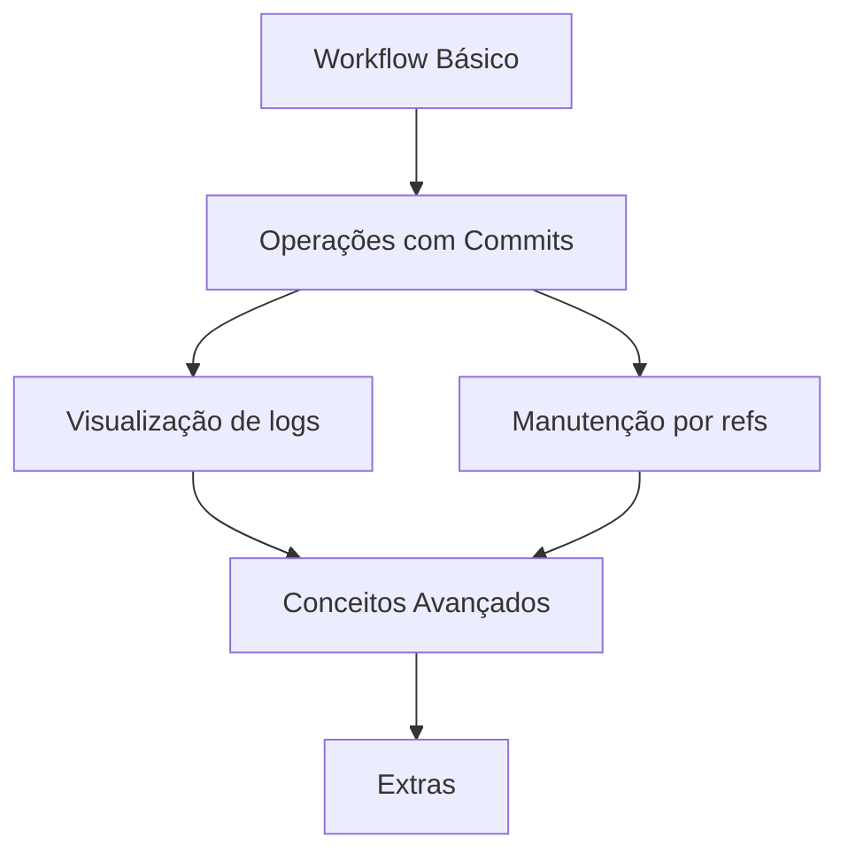

### Dias de Escuridão antes do Git  
Em **1972**, iniciou-se o uso de versionadores de código quando a **Bell Labs**, um sistema pioneiro no conceito de versionamento. Sua contribuição foi tão relevante para a indústria que, pouco depois, surgiu o concorrente **RCS** (*Revision Control System*) em **1982**. À medida que a ideia de controle de versão se difundia na comunidade tech, novos sistemas apareceram para disputar espaço no mercado. Entre eles, destacaram-se o **CVS** (*Concurrent Version System*) de **1986**, o **SVN** (*Subversion*) dos anos **2000**, além de muitos outros ao longo da história. Entretanto, apenas um se tornou o versionador definitivo para desenvolvedores que prezam por praticidade: o **Git**, criado em **2005**.  

#### Ponto de Virada do Git  
Um dos fatores cruciais para o sucesso do Git foi sua natureza **distribuída**, em contraste com os sistemas centralizados da época. Em modelos centralizados, havia apenas uma cópia principal do projeto em um servidor. Os desenvolvedores precisavam "bloquear" arquivos para editá-los, tornando-os indisponíveis para outros até que fossem "desbloqueados". O Git eliminou essa limitação, permitindo trabalho simultâneo e offline.  

Além disso, o Git trouxe soluções eficientes para **merge conflicts** (um dos pesadelos dos desenvolvedores durante *pull* ou *push*) e aprimorou conceitos como *branches* e *pull requests*. Apesar de não ser o pioneiro nessas funcionalidades, destacou-se pela **performance**, **usabilidade** e **DX** (*Developer Experience*), oferecendo um fluxo de desenvolvimento mais intuitivo e colaborativo.  

---
# Meus artigos
- [[PullRequest]]
- [[THE-RISE-OF-GIT]]

# 🤝Workflow Básico
- [[GIT-WORKFLOW]] (Entenda o fluxo de trabalho básico e boas práticas no Git)
- [[GIT-PULLREQUEST]] (Como colaborar e revisar código utilizando pull requests)

## 🔄 Operações com commits
- [[GIT-Reset,Revert,Checkout]] (Diferenças entre reset, revert e checkout)
- [[GIT-SquashCommits]] (Combinar múltiplos commits em 1 )
- [[DEV-SemanticsCommits]] (Como fazer bons commits e como usar emojis neles)

## 🔍Visualização & Navegação
- [[GIT-REFS]] (O que são e como funcionam as referências no Git)
- [[GIT-DIFF]] (Vendo a diferença entre os commits pela diferença deles)
- [[GIT-REFLOG]] (Recuperando referências perdidas com o git reflog)
- [[GIT-LOG]] (Comandos para visualizar o histórico de commits)

## 🧹Manutenção de Repositórios
- [[GIT-IGNORE]]  (fundamental para manter seu repositório limpo e seguro)
- [[GIT-LFS]] (Armazenamento de arquivos grandes utilizando Git Large File Storage)
- [[GIT-GC]] (Gerenciamento e limpeza do repositório com git gc)

## 🛠️ Conceitos Avançados
- [[GIT-Plumbing&Porcelain]] (Entendendo os níveis de comandos do Git)

# 🌟 Extras
- [[GIT-GIST]] (Compartilhamento de snippets e pequenas porções de código)
- [[GIT-GitHubCLI]] (Uso total do Github por meio do terminal)

## 🧩 Fluxo de Conhecimento

