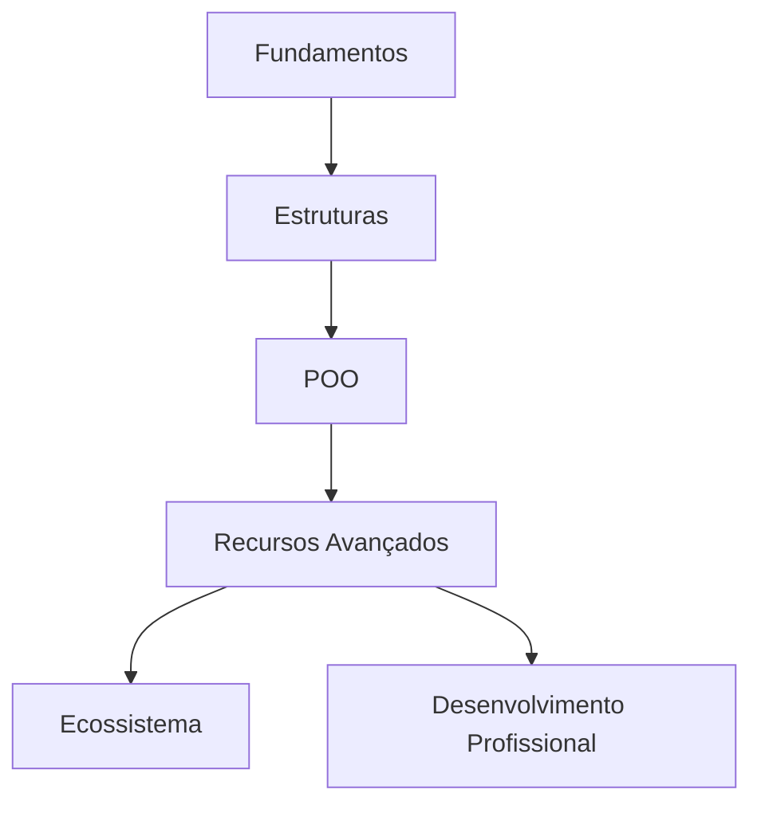

# 💎 Ruby Language

## 🚀 Fundamentos da Linguagem
- [[RUBY-DATATYPES]] - Tipos primitivos e estruturas de dados fundamentais
- [[RUBY-VARIABLES]] - Escopo, nomenclatura e manipulação de variáveis
- [[RUBY-OBJECTS]] - Entendendo o paradigma orientado a objetos no Ruby
- [[RUBY-STYLE]] - Convenções e boas práticas de codificação

## 🧱 Estruturas e Controle de Fluxo
- [[Ruby Conditionals]] - If/else, case/when e expressões condicionais
- [[Ruby Loops]] - Iteração com while, for, each e outras estruturas
- [[Ruby Blocks & Procs]] - Trabalhando com blocos, procs e lambdas

## 🧰 Programação Orientada a Objetos
- [[Ruby Classes & Inheritance]] - Criando e estendendo classes
- [[Ruby Modules & Mixins]] - Composição e reutilização de código
- [[Ruby Instance vs Class Methods]] - Métodos de instância versus métodos de classe

## 🔍 Recursos Avançados
- [[Ruby Metaprogramming]] - Código que gera código
- [[Ruby Gems & Bundler]] - Gerenciamento de pacotes e dependências
- [[Ruby Testing]] - RSpec, Minitest e testes automatizados
- [[Ruby Performance]] - Otimização e dicas de performance

## 🛠️ Ecossistema e Aplicações
- [[Ruby on Rails]] - Framework web MVC
- [[Ruby CLI Tools]] - Criando ferramentas de linha de comando
- [[Ruby & API Development]] - Construindo APIs com Ruby
- [[Ruby Scripting]] - Automação e processamento de dados

## 📊 Desenvolvimento Profissional
- [[Ruby Code Reviews]] - Dicas para revisões de código eficientes
- [[Debugging Ruby]] - Técnicas e ferramentas para depuração
- [[Ruby Documentation]] - Criando e utilizando documentação

## 🧩 Fluxo de Conhecimento

## 📚 Recursos Recomendados
- [[Ruby Koans]] - Aprendizado através de exercícios práticos
- [[Ruby Under a Microscope]] - Entendendo o funcionamento interno do Ruby
- [[Effective Ruby]] - Práticas e idiomas para código Ruby eficiente