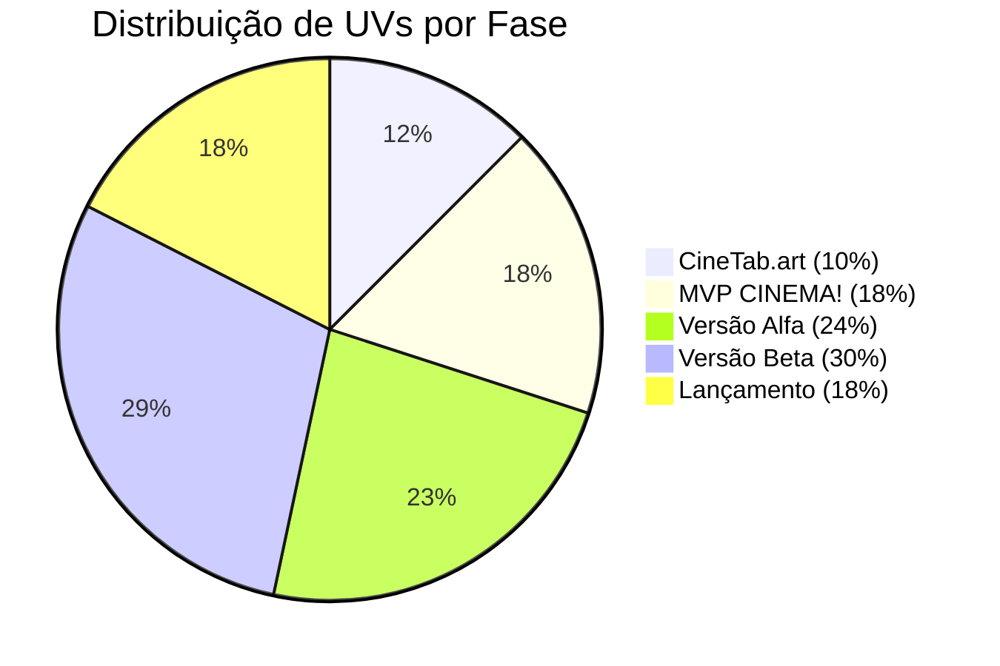

# Dashboard  [[CINEMA!]]

> **Última atualização:** 02/04/2025  
> [[Semana 3]]

# 📊 Status CineScale

| Fase                  | UV Total | UV Concluída | Progresso | Peso Fase | Status      |
| --------------------- | -------- | ------------ | --------- | --------- | ----------- |
| 1. CineTab.art        | 1070★    | 0★           | 0%        | 10%       | ⚡ Ativo     |
| 2. MVP CINEMA!        | 1500★    | 0★           | 0%        | 18%       | 🔄 Pendente |
| 3. Versão Alfa        | 2000★    | 0★           | 0%        | 24%       | 🛑 Inativo  |
| 4. Versão Beta        | 2500★    | 0★           | 0%        | 30%       | 🛑 Inativo  |
| 5. Lançamento Oficial | 1500★    | 0★           | 0%        | 18%       | 🛑 Inativo  |
| **Total**             | 8470★    | 0★           | **0%**    | 100%      |             |

## 🎯 Prioridades Atuais
1. **Definir escopo mínimo do CineTab** - Quais funcionalidades essenciais para lançamento?
2. **Estabelecer identidade visual básica** - Criar design minimalista alinhado com a filosofia "anti-complexidade"
3. **Definir estrutura técnica** - Escolher stack tecnológica adequada para o fórum
4. **Planejar estratégia inicial de comunidade** - Como atrair os primeiros usuários?
5. **Documentar diferenciais em relação ao Letterboxd** - Para guiar desenvolvimento futuro

## 🚧 Bloqueios e Desafios
- **Tempo limitado** - Definir cronograma realista considerando disponibilidade
- **Definição de escopo** - Estabelecer limites claros para o MVP (CineTab) vs. projeto principal (CINEMA!)
- **Estratégia de crescimento** - Como validar o conceito com número mínimo de usuários?

## 🔗 Links Essenciais
- [[Diretrizes CineTab|Filosofia do CineTab]] - Princípios norteadores do fórum
- [[DOCS TECNICA CINETAB#**Stack Escolhida** |STACK ESCOLHIDA DO CINETAB]]- Decisões técnicas para o MVP
- [[DOCS TECNICA CINETAB#FUNCIONALIDADES DEFINIDAS|Funcionalidades Principais do CineTab]] - Lista principal de recursos para o MVP
- [[Aprendendo com a concorrência|Análise do Letterboxd & similares]] - O que aprender e o que evitar diante há concorrência
- [[Planejamento |Roadmap CineTab → CINEMA!]] - Caminho de evolução planejado

## 📝 Notas Rápidas
> O CineTab deve focar na simplicidade e qualidade das discussões, não em recursos
> Priorizar texto sobre imagens - manter o espírito de fóruns clássicos
> Referência de UX: HackerNews + características próprias para discussão de cinema