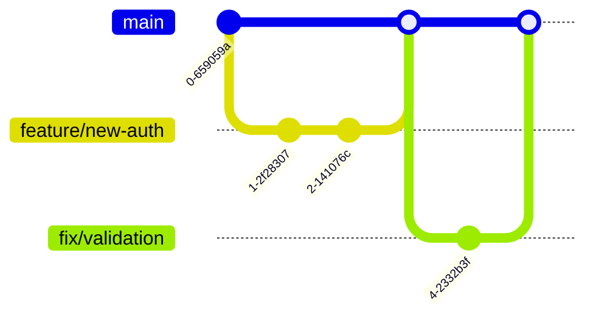

## 📋 Publication Checklist
- [ ] Review spelling and grammar
- [ ] Check SEO: title, meta description, and keywords
- [ ] Include relevant internal and external links
- [ ] Verify images and optimize for SEO
- [ ] Include tags and categories

## 📝 Article Title Options
1. "The Ultimate Guide to Creating Outstanding Pull Requests in 2024"
2. "Advanced Pull Request Workflows: A Deep Technical Guide"
3. "Mastering Pull Requests: From Basic Commits to Complex Workflows"

**Tags:** #development #git #coding #bestpractices #collaboration

## 🎯 Introduction
In today's collaborative development environment, creating effective [[GIT-PULLREQUEST]] (PRs) is a crucial skill. Whether you're contributing to open-source projects or working in a development team, well-crafted PRs can significantly improve code quality. While they may seem simple on the surface, mastering the technical aspects of PRs can significantly improve your development workflow and team collaboration. This comprehensive guide dives deep into the technical details and best practices of creating and managing pull requests.

## 🔑 Development

### Git Workflow Fundamentals


This diagram illustrates a typical feature branch workflow, showing how different types of changes are managed through separate branches.


### Size and Scope Management
- Keep PRs small and focused on a single purpose
- Aim for less than 400 lines of code when possible
- Break large features into smaller, logical PRs
- Each PR should represent one complete unit of work

Example:
```markdown
✅ Good PR: "Add user authentication endpoint"
❌ Bad PR: "Add authentication, user profiles, and email notifications"
```

### Branch Management

#### Branch Naming Conventions
```bash
# Feature branches
feature/[ticket-number]-descriptive-name
feature/JIRA-123-add-oauth-login

# Bug fixes
fix/[ticket-number]-description
fix/BUG-456-fix-login-validation

# Documentation
docs/update-api-docs

# Refactoring
refactor/improve-auth-performance

# Release branches
release/v1.2.0
```

#### Advanced Branch Operations
```bash
# Create and switch to feature branch
git checkout -b feature/new-auth main

# Keep branch updated with main
git fetch origin
git rebase origin/main

# Squash local commits before pushing
git reset --soft HEAD~3
git commit -m "feat: implement OAuth authentication"

# Force push with lease (safer than force push)
git push --force-with-lease origin feature/new-auth
```

### Commit Message Structure
```plaintext
<type>(<scope>): <subject>

<body>

<footer>

# Example:
feat(auth): implement OAuth2 with Google

- Add OAuth2 client configuration
- Implement login and callback endpoints
- Add user profile fetching
- Update authentication middleware

Closes #123
```

Types:
- `feat`: New feature
- `fix`: Bug fix
- `docs`: Documentation
- `style`: Formatting
- `refactor`: Code restructuring
- `test`: Adding tests
- `chore`: Maintenance


### Commit Message Structure
```markdown
<scope>): <subject>

<body>

<footer>

# Example:
feat(auth): implement OAuth2 with Google

- Add OAuth2 client configuration
- Implement login and callback endpoints
- Add user profile fetching
- Update authentication middleware

Closes #123
```

Types:
- `feat`: New feature
- `fix`: Bug fix
- `docs`: Documentation
- `style`: Formatting
- `refactor`: Code restructuring
- `test`: Adding tests
- `chore`: Maintenance

### PR Description Template with Technical Details
```markdown
## 🎯 Purpose
Implement OAuth2 authentication using Google provider.

## 🛠 Technical Implementation
- OAuth2 flow using `passport-google-oauth20`
- JWT token generation with `jsonwebtoken`
- Redis session storage
- Rate limiting middleware

## 🔄 Database Changes
```sql
ALTER TABLE users
ADD COLUMN google_id VARCHAR(255),
ADD COLUMN oauth_access_token TEXT;>)```

### Advanced PR Scenarios

#### Handling Merge Conflicts
```bash
# Method 1: Rebase
git fetch origin
git rebase origin/main
# Fix conflicts in each commit
git add .
git rebase --continue

# Method 2: Merge
git fetch origin
git merge origin/main
# Fix conflicts
git add .
git commit -m "merge: resolve conflicts with main"
```

#### Interactive Rebasing
```bash
# Cleanup commits before PR
git rebase -i HEAD~5

# Common rebase commands
# p, pick = use commit
# r, reword = use commit but edit message
# s, squash = combine with previous commit
# f, fixup = combine and discard message
# d, drop = remove commit
```

### Visual Representation of PR Lifecycle


## 💬 Conclusion
Creating effective pull requests requires a deep understanding of Git workflows, code review practices, and team collaboration. By following these technical best practices and utilizing automation tools, you can create PRs that are easier to review and maintain high code quality standards.

### Call to Action
Start implementing these technical practices in your next PR. Create a custom PR template for your team and set up automated checks using the provided GitHub Actions workflow. Share your experiences and refinements with the community.

---
**Meta Description:** Master the technical aspects of creating effective pull requests with our comprehensive guide covering advanced Git workflows, automation, and best practices for modern development teams.

**Keywords:** pull request technical guide, git workflow, PR automation, code review checklist, branch management, commit conventions, PR templates, GitHub Actions

**Internal Links:**
- [[GIT-WORKFLOW]]
- [[GIT-PULLREQUEST]]


**External Links:**
	
- [GitHub Pull Request Documentation](https://docs.github.com/en/pull-requests)
- [Git Branching Strategies](https://git-scm.com/book/en/v2/Git-Branching-Branching-Workflows)