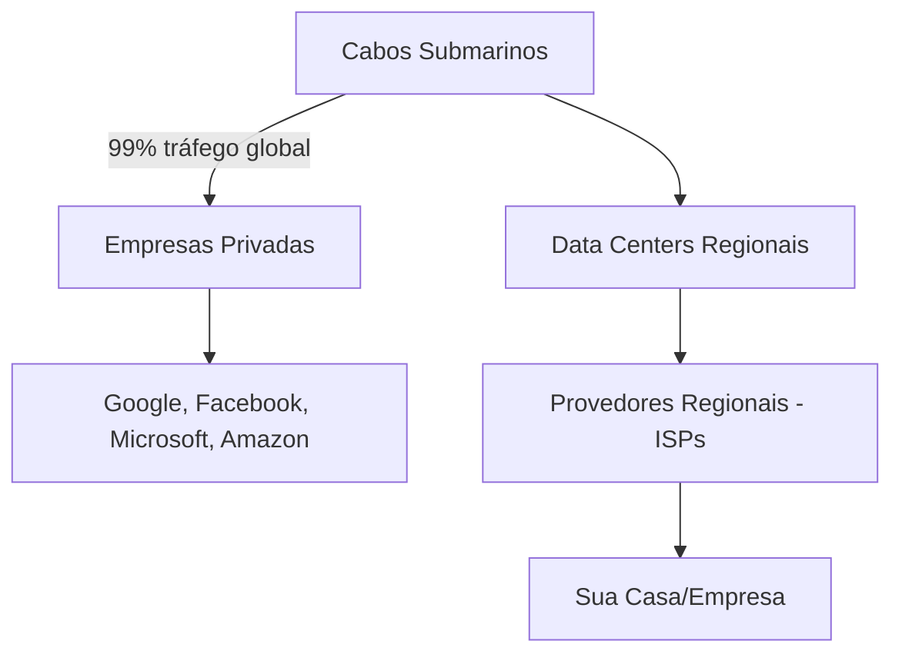

# A Web Como Sistema Global - Poder, Controle e Infraestrutura

## 🎯 Quem "Possui" a Internet?

**Definição**: A Internet não pertence a ninguém e pertence a todos simultaneamente - é um sistema descentralizado onde diferentes entidades controlam diferentes camadas da infraestrutura global.

Esta descentralização aparente esconde concentrações reais de poder que podem afetar bilhões de pessoas através de decisões corporativas ou governamentais.

## 🔧 Camadas de Controle da Internet

**Infraestrutura Física (Quem Controla os "Canos")**:


**Cabos Submarinos**:
- **Controle**: Empresas privadas (Google, Meta, Microsoft, Amazon)
- **Realidade**: 99% do tráfego intercontinental passa por ~400 cabos
- **Vulnerabilidade**: Poucos pontos de falha podem isolar continentes inteiros

**Data Centers**:
- **Gigantes**: AWS (Amazon), Azure (Microsoft), Google Cloud
- **Concentração**: Maioria dos serviços online roda em poucos data centers
- **Poder**: Podem "desligar" serviços globalmente

## 🔧 Controle Lógico da Internet

**Nomes de Domínio (ICANN)**:
- **Função**: Controla sistema de nomes (.com, .org, .br)
- **Localização**: Estados Unidos (influência geopolítica)
- **Poder**: Pode revogar domínios de países inteiros

**Protocolos e Padrões**:
- **W3C**: Define padrões web (HTML, CSS)
- **IETF**: Define protocolos de rede (HTTP, TCP/IP)
- **IEEE**: Define padrões de hardware (Wi-Fi, Ethernet)

**Root Servers (13 Servidores Raiz)**:
- **Localização**: Maioria nos EUA e Europa
- **Função**: Direcionam todas as consultas DNS globais
- **Vulnerabilidade**: Ataque coordenado poderia fragmentar a Internet

## 🔧 Onde a Internet "Fica Armazenada"

**Realidade Física**:
```
Internet = Cabo de Fibra Ótica + Servidores + Roteadores
          ↓
          Espalhados fisicamente pelo mundo todo
          ↓
          Em data centers, centrais telefônicas, cabos subterrâneos/submarinos
```

**Principais Locais**:
- **Ashburn, Virginia**: "Capital da Internet" - maior concentração de data centers
- **Cabos Transatlânticos**: Europa ↔ América do Norte
- **Singapura**: Hub da Internet asiática
- **São Paulo**: Principal ponto de troca brasileiro (PTT.br)

**Data Centers Críticos**:
- **Google**: 21+ data centers globais
- **AWS**: 84 zonas de disponibilidade
- **Facebook**: 18 data centers próprios
- **Microsoft Azure**: 60+ regiões globais

## 💻 Aplicação Prática

**Exemplo**: O que acontece quando você acessa YouTube

```
1. Seu ISP local → Backbone nacional → Cabo submarino
2. Requisição chega ao data center do Google mais próximo
3. Servidor específico processa sua solicitação
4. Vídeo é transmitido de volta pelo mesmo caminho
5. CDN (Content Delivery Network) otimiza entrega regional
```

**Pontos de Controle no Fluxo**:
- **ISP**: Pode bloquear sites (censura local)
- **Backbone**: Operadoras podem priorizar tráfego
- **Data Center**: Google pode remover vídeos globalmente
- **CDN**: Cache regional pode ser manipulado

## 🔧 É Possível "Desligar" a Internet Global?

**Cenários Realistas**:

**1. Fragmentação Regional**:
- **China**: Great Firewall isola parcialmente o país
- **Irã/Coreia do Norte**: Controle estatal rígido
- **Rússia**: Lei de "Internet Soberana" permite isolamento

**2. Falhas de Infraestrutura**:
- **2021**: Cabo submarino cortado isola Tonga por semanas
- **2022**: Ataque cibernético derruba Internet na Ucrânia
- **Regularly**: Desastres naturais cortam conexões regionais

**3. Decisões Corporativas**:
- **AWS Down**: Derruba Netflix, Spotify, e milhares de sites
- **Cloudflare**: Protege ~20% dos sites globais
- **BGP Hijacking**: Redirecionamento malicioso de tráfego

**4. Controle Governamental**:
- **Shutdown nacional**: Índia já fez 100+ vezes
- **DNS Poisoning**: Alterar resoluções de domínios
- **Deep Packet Inspection**: Filtrar conteúdo específico

## 🔧 Cenário de "Internet Apocalipse"

**Para Desligar Completamente**:
```
1. Cortar todos os cabos submarinos (400+ cabos)
2. Desligar todos os data centers (milhares globalmente)  
3. Atacar todos os pontos de troca (PTTs)
4. Comprometer todos os ISPs regionais
5. Destruir infraestrutura de satélites

= Praticamente impossível coordenar globalmente
```

**Mais Provável: Fragmentação**:
- Internet dividida em "blocos regionais"
- China, EUA, Europa com internets separadas
- Alguns países completamente isolados
- Intranets nacionais substituindo Internet global

## 🔗 Síntese - Do HTML ao Sistema Global

Este capítulo conecta tudo: o HTML que escrevemos roda em servidores físicos, transmitido por cabos reais, controlados por empresas específicas, regulados por governos. Cada `<div>` que criamos existe dentro desta infraestrutura geopolítica complexa.

## 🧠 Por Que Isso Importa?

Compreender o sistema global é crucial porque:
- **Dependência**: Nossos projetos dependem de infraestrutura que não controlamos
- **Resiliência**: Planejar para falhas de infraestrutura
- **Geopolítica**: Regulamentações afetam desenvolvimento web
- **Ética**: Responsabilidade sobre onde hospedamos e como construímos
- **Futuro**: Mudanças na Internet global afetam carreiras técnicas

## 🌐 Internet do Futuro

**Tendências de Descentralização**:
- **Blockchain**: Redes peer-to-peer
- **IPFS**: Sistema de arquivos distribuído
- **Starlink**: Internet via satélites globais
- **Mesh Networks**: Redes locais interconectadas

**Riscos de Centralização**:
- **Big Tech**: Concentração em poucas empresas
- **Surveillance Capitalism**: Monetização de dados
- **Digital Divide**: Internet para ricos vs pobres
- **Authoritarian Control**: Governos autoritários

---
💡 **Meta-Insight**: A Internet parece infinita e etérea, mas é feita de cabos físicos, servidores em prédios reais, controlada por pessoas e empresas específicas. Como desenvolvedor web, você não está criando código "na nuvem" - está criando código que roda em computadores físicos, de propriedade de corporações, regulados por governos, alimentados por energia elétrica real. A web é física, política e frágil. Nossa responsabilidade vai além do código - somos guardiões de uma infraestrutura crítica para a humanidade.