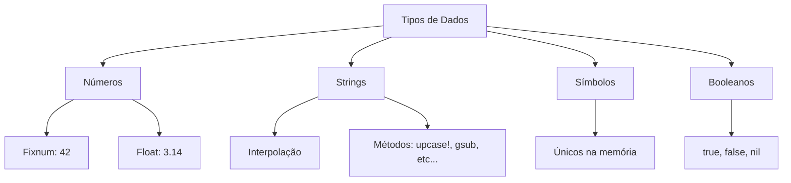

## Conceitos Centrais  
- **Definição Simplificada:**  
  - **Números:** `Fixnum` (inteiros) e `Float` (decimais).  
  - **Strings:** Sequências de caracteres entre `""` ou `''`.  
  - **Símbolos:** Identificadores imutáveis (ex: `:nome`).  
  - **Booleanos:** `true` (verdadeiro), `false` (falso), `nil` (ausência de valor).  
- **Palavras-Chave:**  
  `to_i`, `to_f`, `snake_case`, interpolação (`#{}`), `object_id`.  

---

## Perguntas Críticas  
1. **O que são?**  
   - **Números:** Representam valores matemáticos (ex: `42`, `3.14`).  
   - **Strings:** Texto (ex: `"Ruby"`).  
   - **Símbolos:** Identificadores únicos (ex: `:status`).  
   - **Booleanos:** Valores lógicos (`true`/`false`) e `nil`.  

2. **Por que existem?**  
   - **Números:** Para cálculos e operações matemáticas.  
   - **Strings:** Manipulação de texto e dados textuais.  
   - **Símbolos:** Otimizar memória em chaves de hashes.  
   - **Booleanos:** Controle de fluxo lógico em programas.  

3. **Como funcionam?**  
   - **Conversões:**  
     ```ruby  
     13.to_f    #=> 13.0  
     "42".to_i  #=> 42  
     ```  
   
- **Interpolação:** `"Nome: #{nome}"` (só em `""`).  
- **Operações:** `+`, `<<`, `gsub`, `upcase!`.  

4. **O que acontece se...?**  
   - Misturar tipos sem conversão?  
     ```ruby  
     "42" + 42 #=> TypeError  
     ```  
   
- Usar `upcase!` em strings compartilhadas?  
     ```ruby  
     a = "texto"; b = a; b.upcase! # Altera ambos!  
     ```  


---

## O que fazer & O que não fazer  
| **Correto**          | **Errado**            | **Por Que?**                              |     |
| -------------------- | --------------------- | ----------------------------------------- | --- |
| `idade = 30`         | `Idade = 30`          | `snake_case` é a convenção Ruby.          |     |
| `"Total: #{10 + 5}"` | `"Total: " + 15.to_s` | Interpolação é mais legível.              |     |
| `:status` (símbolo)  | `"status"` (string)   | Símbolos são imutáveis e mais eficientes. |     |
| `numero = 5.0.to_i`  | `numero = 5.9.to_i`   | `.to_i` trunca decimais (5.9 → 5).        |     |

---

## Conexões  
- **Relacionado a:**  
  - **Hashes:** Símbolos são ideais para chaves (ex: `{ nome: "Ana" }`).  
  - **Condicionais:** `true`/`false` controlam fluxos (`if`, `else`).  
- **Diferenças-chave:**  
  - == vs === : Comparação vs. igualdade estrita.  
  - **`nil` vs `false`:** `nil` é "nada", `false` é valor booleano.  

---

## Aplicações Práticas  
- **Casos de Uso:**  
  - Formatar mensagens: `"Olá, #{nome.upcase}!"`.  
  - Calcular IMC: `peso / (altura ** 2)`.  
- **Exercícios/Desafios:**  
  1. Converta `"123.45"` para Float e adicione 10.  
  2. Use `gsub` para substituir todos os espaços em `"Ruby é incrível"` por `_`.  
- **Erros Comuns:**  
  - Esquecer de fechar aspas em strings.  
  - Usar == em vez de = para atribuição.  

---

## Resumo Rápido  
- ✅ **Números:** `5.to_f` para decimais, `17 / 5.0 = 3.4`.  
- ✅ **Strings:** Interpolação (`#{}`), métodos como `upcase!` (modifica in-place).  
- ✅ **Símbolos:** Imutáveis, únicos na memória (`:nome.object_id`).  
- ✅ **Booleanos:** `nil` é tratado como `false` em condicionais.  

---

## Autoavaliação  
- [ ] Sei converter `"42"` para inteiro e `42` para string.  
- [ ] Entendo por que `:nome.object_id` é igual em múltiplos usos.  
- [ ] Consigo explicar a diferença entre `<<` e `+` em strings.  

---

## Conhecimentos Avançados  
### Mutabilidade e `object_id`  
- **Objetos imutáveis:**  
  ```ruby  
  a = 42  
  b = 42  
  a.object_id == b.object_id #=> true (Fixnum compartilhado)  
  ```  
- **Objetos mutáveis:**  
  ```ruby  
  str1 = "Ruby"  
  str2 = "Ruby"  
  str1.object_id == str2.object_id #=> false (objetos diferentes)  
  ```  

### Troca de Valores sem Variável Temporária  
```ruby  
a, b = 10, 20  
a, b = b, a # Troca valores em uma linha!  
puts "a=#{a}, b=#{b}" #=> a=20, b=10  
```  

### Métodos Destrutivos e Cópias Seguras  
- Use `dup`/`clone` para evitar efeitos colaterais:  
  ```ruby  
  arr1 = [1, 2]  
  arr2 = arr1.dup  
  arr2 << 3  
  puts arr1 #=> [1, 2]  
  ```  

---

## Referências  
- **Documentação Ruby:** [Tipos de Dados](https://ruby-doc.org/core-3.0.0/)  
- **Livro Recomendado:** *"Eloquent Ruby"* (Russ Olsen).  
- **Ferramentas:** [Ruby REPL](https://replit.com/languages/ruby) para testes rápidos.  

---

## FAQ  
**Q: Como converter `nil` para string?**  
**A:** `nil.to_s` retorna `""` (string vazia).  

**Q: Por que usar símbolos em hashes?**  
**A:** São imutáveis e otimizados, evitando duplicação na memória.  

**Q: Qual a diferença entre `'texto'` e `"texto"`?**  
**A:** Aspas duplas permitem interpolação e caracteres de escape (`\n`).  

---

