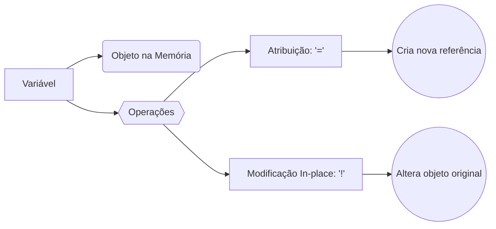

27-March-2025 | 19:09

Status: #done 

---
## Conceitos Centrais  
- **Definição Simplificada:**  
  Variáveis são *referências* a dados na memória. Elas atuam como "rótulos" que apontam para objetos, permitindo reutilização e manipulação dinâmica de valores.  
- **Palavras-Chave:**  
  Atribuição (=), operadores compostos (`+=`, `<<`), `snake_case`, mutabilidade, `object_id`.  

---

## Perguntas Críticas  
1. **O que é?**  
   Um nome que referencia um objeto na memória (ex: `nome = "Ana"`).  

2. **Por que existe?**  
   Para armazenar dados de forma flexível, evitando repetição e permitindo operações dinâmicas.  

3. **Como funciona?**  
   - **Atribuição:** `var = valor` (cria uma referência).  
   - **Reatribuição:** `var = novo_valor` (sobrescreve a referência).  
   - **Operações in-place:** Métodos como `<<` e `upcase!` modificam o objeto original.  

4. **O que acontece se...?**  
   - Modificar um objeto compartilhado entre variáveis?  
   ```ruby  
   a = "texto"  
   b = a  
   b.upcase! # Altera tanto `a` quanto `b`!  
   ```  

---

## O que fazer & O que não fazer  
| **Correto**                | **Errado**               | **Por Que?**                                  |  
|----------------------------|--------------------------|-----------------------------------------------|  
| `preco_total = 100`        | `x = 100`                | Nomes descritivos melhoram legibilidade.      |  
| `saldo += 50`              | `saldo = saldo + 50`     | Forma concisa vs. redundante.                 |  
| `nome = "Maria"`           | `Nome = "Maria"`         | `snake_case` é a convenção Ruby.              |  
| `lista = [1, 2]; lista << 3` | `lista = [1, 2] + [3]`  | `<<` modifica in-place; `+` cria novo objeto.  |  

---

## Conexões  
- **Relacionado a:**  
  - **Escopo de variáveis:** `local`, `global`, `instance`.  
  - **Constantes:** Escritas em `UPPER_CASE` (ex: `PI = 3.14`).  
- **Diferenças-chave:**  
  - = vs == :  Atribuição vs. comparação de igualdade.  
  - **Variáveis vs. símbolos:** Símbolos (`:nome`) são imutáveis e únicos na memória.  

---

## Aplicações Práticas  
- **Casos de Uso:**  
  - Calcular total de vendas: `total += preco_item`.  
  - Formatar texto dinamicamente: `mensagem = "Olá, #{nome}"`.  
- **Exercícios/Desafios:**  
  1. Crie uma variável `contador` que incremente de 3 em 3 usando `+=`.  
  2. Teste: `a = "hello"; b = a; b << " world"; puts a`.  
- **Erros Comuns:**  
  - Ao fazer comparações usar = (para atribuição) em vez de == para fazer a comparação  
  - Esquecer que variáveis compartilhadas apontam para o mesmo objeto.  

---

## Resumo Rápido  
- ✅ Variáveis são **referências**, não os próprios objetos.  
- ✅ Operadores como `+=` criam novos objetos; `<<` modifica in-place.  
- ✅ Use `snake_case` para nomes (ex: `idade_usuario`).  
- ✅ Métodos com `!` (ex: `upcase!`) alteram o objeto original.  

---

## Autoavaliação  
- [ ] Consigo explicar a diferença entre = e ==   
- [ ] Entendo por que `a = [1,2]; b = a; b << 3` altera `a`.  
- [ ] Sei quando usar `dup` ou `clone` para evitar efeitos colaterais.  

---

## Conhecimentos Avançados  
### Mutabilidade e `object_id`  

**Objetos imutáveis:** Números e símbolos compartilham o `object_id` se forem iguais:  

  ```ruby  
  a = 42  
  b = 42  
  puts a.object_id == b.object_id #=> true  
  ```  

**Objetos mutáveis:** Strings e arrays têm `object_id` único mesmo com conteúdo igual: 

### Troca de Valores sem Variável Temporária  
```ruby  
a = 5  
b = 10  
a, b = b, a # Troca valores em uma linha!  
puts "a=#{a}, b=#{b}" #=> a=10, b=5  
```  

### Métodos Destrutivos e Cópias Seguras  

Use `dup` ou `clone` para criar cópias independentes:  

  ```ruby  
  arr1 = [1, 2]  
  arr2 = arr1.dup  
  arr2 << 3  
  puts arr1 #=> [1, 2]  
  ```  

---

## Referências  
- **Documentação Ruby:** [Variáveis](https://ruby-doc.org/docs/ruby-doc-bundle/UsersGuide/rg/variables.html)  
- **Livro Recomendado:** *"The Well-Grounded Rubyist"* (David A. Black).  
- **Ferramentas:** [Ruby REPL](https://replit.com/languages/ruby) para testes rápidos.  

---

## FAQ  
**Q: Por que `desired_location` muda se eu modificar `johns_location`?**  
**A:** Ambas apontam para o mesmo objeto. Métodos destrutivos (ex: `upcase!`) alteram o objeto compartilhado.  

**Q: Posso usar números em nomes de variáveis?**  
**A:** Sim, mas não no início. Ex: `item1` (válido), `1item` (inválido).  

**Q: Qual a diferença entre `nil` e `false`?**  
**A:** `nil` representa "nada"; `false` é um valor booleano. Em condicionais, ambos são tratados como "falso", mas `nil == false` retorna `false`.  

---


--- 

**Como Esta Nota Ajuda:**  
- Revisão rápida de sintaxe e boas práticas.  
- Alertas sobre comportamentos "surpresa" (ex: mutabilidade).  
- Links para recursos profundos quando necessário.>)