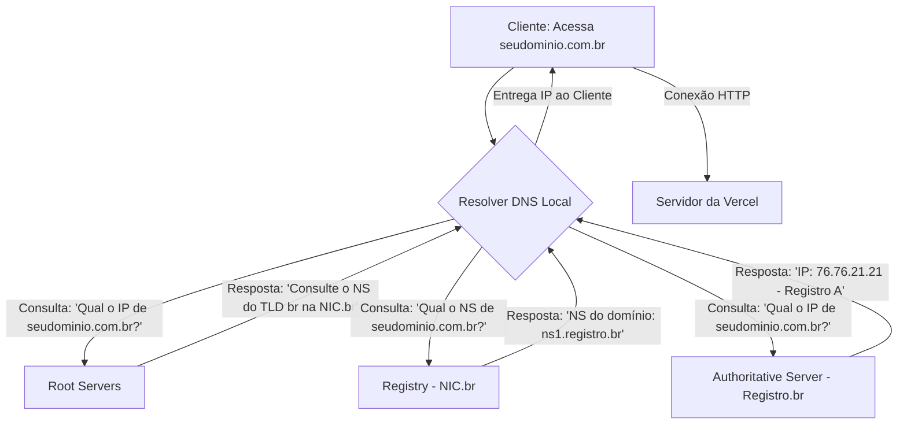
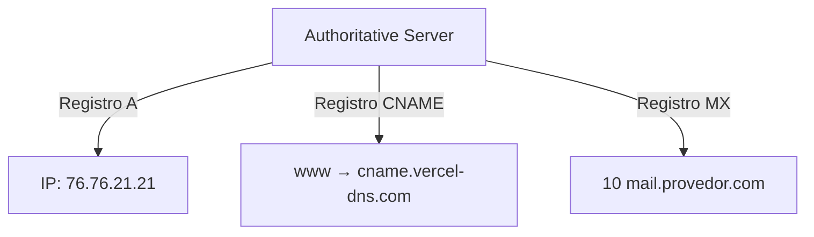

# **O "Livro de Endereços" da Internet**  

#### **O que é DNS?**  
O **DNS (Domain Name System)** é um sistema fundamental da internet que funciona como um **tradutor entre nomes humanos e números máquinas**. Sua principal função é converter domínios legíveis (como `cinetab.art.br`) em endereços de **IP (Internet Protocol)**, que são números únicos que identificam servidores na rede.  

#### **Funcionamento Simplificado**  
Imagine o DNS como uma **agenda de contatos global**:  

| **Domínio (Chave)**       | **IP (Valor)**         |  
|---------------------------|------------------------|  
| `cinetab.art.br`          | `200.221.214.101`      |  
| `youtube.com`             | `142.250.218.110`      |  
| `wikipedia.org`           | `208.80.153.224`       |  

Sem o DNS, você precisaria decorar sequências numéricas como `142.250.218.110` para acessar sites – algo impraticável!  

---

#### **Como o DNS Funciona Passo a Passo**  
Quando você digita um domínio no navegador:  
1. **Digitação do domínio**: Ex.: `cinetab.art.br`;  
2. **Consulta ao DNS**:  
   - Seu computador pergunta a um **servidor DNS recursivo** (geralmente do seu provedor de internet): *"Qual é o IP de `cinetab.art.br`?"*;  
3. **Resolução hierárquica**:  
   - O servidor DNS consulta a hierarquia global:  
     - **Root Server** (raiz): Indica onde está o servidor `.br`;  
     - **TLD Server** (`.br`): Direciona para o servidor responsável por `art.br`;  
     - **Authoritative Server**: Responde com o IP correto do domínio.  
4. **Retorno do IP**: O navegador recebe o endereço (ex.: `200.221.214.101`);  
5. **Conexão final**: Seu dispositivo acessa o servidor usando o IP.  

---

#### **Por Que Domínios São "Mentiras"?**  
Domínios são apenas **apelidos memoráveis** para IPs, que são os **endereços reais** na internet.  
- **Analogia**: Assim como você salva "Maria" no celular em vez do número `+55 11 98765-4321`, o DNS simplifica sua vida online.  
- **Motivo técnico**: IPs podem mudar (ex.: migração de servidor), mas o domínio permanece o mesmo.  

---

#### **Além do Básico: Tipos de Registros DNS**  
O DNS não armazena apenas IPs. Veja outros registros comuns:  

| **Tipo de Registro** | **Função**                                   | **Exemplo**                     |  
|-----------------------|---------------------------------------------|----------------------------------|  
| **A**                 | Mapeia domínio para IPv4.                   | `cinetab.art.br → 200.221.214.101` |  
| **AAAA**              | Mapeia domínio para IPv6.                   | `google.com → 2607:f8b0:4005:802::200e` |  
| **CNAME**             | Cria um alias (apelido) para outro domínio. | `www.cinetab.art.br → cinetab.art.br` |  
| **MX**                | Direciona e-mails para servidores.          | `@cinetab.art.br → mail.servidor.com` |  

---

#### **Ferramentas para Explorar DNS**  
1. **nslookup**:  
   - No terminal, digite `nslookup cinetab.art.br` para ver o IP.  
2. **DNS Checker** (https://dnschecker.org):  
   - Verifica a propagação global de registros DNS.  


"O DNS é o **herói invisível** da internet: sem alardes, ele transforma `youtube.com` em números que roteadores entendem, como um tradutor simultâneo conectando humanos e máquinas. Domínios são mentiras úteis – mentirinhas que nos poupam de decorar `142.250.218.110` toda vez que queremos ver um vídeo. Afinal, quem precisa de números quando se tem um bom apelido?"  


# Workflow de um DNS
Vamos mergulhar na parte técnica do DNS e no fluxo completo de uma configuração de domínio, desde o registro até a resolução. Isso inclui conceitos como **TLD**, **Registry**, **Registrar**, **Authoritative Server**, e a hierarquia do DNS. Entender esse fluxo é fundamental para gerenciar domínios e resolver problemas como profissional.

---

### **1. Componentes do Sistema DNS**
Para entender o fluxo, primeiro precisamos definir os principais atores:

| Componente          | Descrição                                                                                     | Exemplo (no seu caso)               |
|----------------------|---------------------------------------------------------------------------------------------|-------------------------------------|
| **Registrant**       | Você, o dono do domínio.                                                                     | Você (dono do domínio `.com.br`).    |
| **Registrar**        | Empresa que vende e gerencia domínios para você.                                             | Registro.br.                        |
| **Registry**         | Organização que controla um TLD (Top-Level Domain).                                          | NIC.br (gerencia `.br`).             |
| **TLD**              | Domínio de nível superior, como `.com`, `.br`, `.org`.                                       | `.br` (gerenciado pelo NIC.br).      |
| **Root Servers**     | 13 servidores raiz globais que direcionam consultas para os TLDs.                            | `a.root-servers.net`, `b.root-servers.net`, etc. |
| **Authoritative Server** | Servidor que contém as configurações DNS do seu domínio (ex: registros A, CNAME, MX).    | Servidor do Registro.br ou da Vercel. |

---

### **2. Fluxo Técnico de uma Consulta DNS**
Quando alguém digita `www.seudominio.com.br` no navegador, ocorre o seguinte processo:

#### **Passo 1: Consulta ao Resolver DNS Local**
- O navegador pergunta ao **resolver DNS local** (ex: DNS do seu provedor de internet) qual é o IP de `www.seudominio.com.br`.
- Se o resolver não tiver a resposta em cache, ele inicia uma consulta recursiva.

#### **Passo 2: Consulta os Root Servers**
- O resolver pergunta a um **Root Server**: "Qual é o servidor responsável pelo TLD `.br`?"
- O Root Server responde com o endereço do **Registry** do TLD `.br` (no caso, o NIC.br).

#### **Passo 3: Consulta ao Registry (TLD)**
- O resolver pergunta ao **Registry do .br** (NIC.br): "Qual é o servidor autoritativo para `seudominio.com.br`?"
- O NIC.br responde com os **nameservers** configurados no domínio (ex: `ns1.registro.br`, `ns2.registro.br`).

#### **Passo 4: Consulta ao Authoritative Server**
- O resolver pergunta ao **Authoritative Server** (ex: servidor do Registro.br) pelo registro `www.seudominio.com.br`.
- O Authoritative Server responde com o **valor do registro DNS** (ex: IP `76.76.21.21` se configurado um registro A para a Vercel).

#### **Passo 5: Resposta ao Cliente**
- O resolver retorna o IP ao navegador, que então se conecta ao servidor da Vercel.

---

### **3. Hierarquia do DNS em Detalhe**
A estrutura do DNS é **decentralizada** e hierárquica. Veja como tudo se conecta:



### **Explicação do Fluxograma**
1. **Cliente**: Inicia o processo digitando o domínio no navegador.
2. **Resolver DNS Local**: Responsável por descobrir o IP correspondente ao domínio.
3. **Root Servers**: Indicam qual é o **Registry** responsável pelo TLD (ex: `.br` → NIC.br).
4. **Registry (NIC.br)**: Fornece os **nameservers** autoritativos do domínio (ex: `ns1.registro.br`).
5. **Authoritative Server (Registro.br)**: Retorna os registros DNS configurados (ex: registro A para a Vercel).
6. **Conexão HTTP**: O navegador usa o IP para se conectar ao servidor onde seu projeto está hospedado.

### Exemplo de adição de registros:


### **Detalhes Técnicos Adicionais**
- **Root Servers**: Existem 13 servidores raiz (de `a.root-servers.net` a `m.root-servers.net`), distribuídos globalmente.
- **TTL (Time-to-Live)**: Cada resposta DNS inclui um TTL, que define por quanto tempo o resolver pode armazenar a resposta em cache.
- **Caching**: Resolvers (como o do Google ou Cloudflare) armazenam respostas para reduzir o tempo de consulta.

---

### **4. O Papel do Registrar (Registro.br) e do Registry (NIC.br)**
- **Registrar (Registro.br):**  
  Atua como intermediário entre você (Registrant) e o Registry (NIC.br). Ele atualiza o registro do seu domínio no NIC.br e gerencia sua zona DNS se você usar o **Modo Avançado** (Authoritative Server).

- **Registry (NIC.br):**  
  Mantém o banco de dados central de todos os domínios `.br`. Quando você compra um domínio via Registro.br, o NIC.br registra que `seudominio.com.br` pertence a você e aponta para os nameservers configurados.

---

### **5. Authoritative Server: O Coração da Configuração**
Quando você usa o **Modo Avançado** do Registro.br, está configurando um **Authoritative Server** para seu domínio. Isso significa que:
- O Registro.br hospeda sua zona DNS.
- Você define registros como `A`, `CNAME`, `MX`, `TXT` diretamente nele.
- Qualquer consulta ao seu domínio terminará aqui para obter as respostas.

**Exemplo de Zona DNS no Registro.br:**
```plaintext
@        A     3600    76.76.21.21     → Domínio raiz aponta para a Vercel.
www    CNAME   3600    cname.vercel-dns.com → Subdomínio www usa CNAME.
@       MX     3600    10 mail.provedor.com → Registro de e-mail (opcional).
```

---

### **6. Estrutura & Propagação  do DNS: O Que Acontece nos Bastidores
Vamos estruturar o entendimento de forma mais detalhada, integrando o contexto teórico com a análise do comando  `dig +trace` onde revela o processo hierárquico de resolução DNS. Vamos desmontar o que acontece em cada etapa:

---

#### **6.1 Consulta aos Root Servers (.)**  
O DNS começa consultando os **servidores raiz** (a.root-servers.net até m.root-servers.net).  
- **Função:** Direcionar a consulta para os servidores do TLD (Top-Level Domain) correto, no caso, `.br`.  
- **No `dig`:**  
  ```plaintext
  . 67869 IN NS a.root-servers.net.
  ...  
  ;; Received 1097 bytes from 192.168.1.1#53(192.168.1.1) in 20 ms
  ```  
  - O resolver local (ex: roteador doméstico, `192.168.1.1`) encaminha a consulta para um root server (ex: `c.root-servers.net`).

---

#### **6.2 Consulta aos Servidores do TLD (.br)**  
Os root servers direcionam a consulta para os servidores autoritativos do `.br`, operados pelo **Registro.br**:  
- **No `dig`:**  
  ```plaintext
  br. 172800 IN NS a.dns.br.
  ...  
  ;; Received 742 bytes from 198.97.190.53#53(h.root-servers.net)
  ```  
  - **TTL do NS:** `172800` segundos (48 horas) – tempo que resolvers armazenam a informação de que o `.br` é gerenciado por `a.dns.br`, `b.dns.br`, etc.  
  - **DNSSEC:** A presença de registros `DS` e `RRSIG` indica validação de segurança DNSSEC.

---

#### **6.3 Consulta aos Servidores Autoritativos do Domínio**  
O servidor do TLD (ex: `a.dns.br`) responde com os **nameservers do domínio** (`ns1.vercel-dns.com` e `ns2.vercel-dns.com`):  
- **No `dig`:**  
  ```plaintext
  cinetab.art.br. 3600 IN NS ns1.vercel-dns.com.
  ...  
  ;; Received 257 bytes from 200.219.148.10#53(a.dns.br)
  ```  
  - **TTL do NS:** `3600` segundos (1 hora) – tempo que resolvers armazenam a referência aos nameservers do domínio.  
  - **NSEC:** Indica a ordem dos registros no zone file (para DNSSEC).

---

#### **6.4 Consulta aos Nameservers do Domínio**  
Os nameservers do domínio (no caso, Vercel) retornam os registros solicitados:  
- **Para o TXT:**  
  ```plaintext
  cinetab.art.br. 60 IN TXT "o forum onde..."  
  ;; Received 119 bytes from 198.51.45.13#53(ns2.vercel-dns.com)
  ```  
  - **TTL:** `60` segundos – tempo de cache para o registro TXT.  

- **Para o A:**  
  ```plaintext
  cinetab.art.br. 1800 IN A 76.76.21.98  
  ;; Received 75 bytes from 198.51.44.13#53(ns1.vercel-dns.com)
  ```  
  - **TTL:** `1800` segundos (30 minutos) – tempo de cache para o registro A.

---

### **Propagação de DNS: O Papel do TTL**  
O TTL (*Time-To-Live*) define quanto tempo um resolver armazena um registro em cache. No exemplo:  
- **Registro A:** TTL de 30 minutos → Resolvers atualizam o IP após 30 minutos.  
- **Registro TXT:** TTL de 1 minuto → Atualização quase imediata.  
- **Nameservers (NS):** TTL de 1 hora → Mudanças nos nameservers levam até 1 hora para serem reconhecidas.  

**Por que até 48 horas?**  
Alguns resolvers ignoram TTLs ou estão em redes com atualização lenta. Ferramentas como [DNS Checker](https://dnschecker.org/) verificam a propagação global.

---

### **DNS Records: Para Que Servem?**  
Os registros DNS são como "instruções" que direcionam o tráfego na internet. Principais tipos:

| **Record** | **Função**                                     | **Exemplo**                          |
|------------|-----------------------------------------------|---------------------------------------|
| **A**      | Mapeia um domínio para IPv4.                  | `cinetab.art.br → 76.76.21.98`       |
| **AAAA**   | Mapeia um domínio para IPv6.                  | `example.com → 2001:db8::1`          |
| **CNAME**  | Cria um alias para outro domínio.             | `www.site.com → site.com`            |
| **MX**     | Direciona e-mails para servidores de email.   | `@ → mail.provedor.com`              |
| **TXT**    | Armazena informações textuais (SPF, DKIM).   | `"v=spf1 include:_spf.google.com ~all"` |
| **NS**     | Define os nameservers do domínio.            | `cinetab.art.br → ns1.vercel-dns.com`|
| **SOA**    | Contém informações administrativas da zona.  | `serial=2024040801` (atualizações)   |

---

### **Casos de Uso Comuns**  
1. **Migração de Servidor:**  
   - Atualize o registro **A** com o novo IP e aguarde o TTL expirar.  
2. **Alias de Subdomínio:**  
   - Use **CNAME** para `blog.dominio.com` apontar para `dominio.com`.  
3. **Proteção contra Spam:**  
   - Adicione um registro **TXT** com políticas SPF/DKIM.  
4. **Balanceamento de Carga:**  
   - Use múltiplos registros **A** com IPs diferentes para distribuir tráfego.

---

### **Observações do `dig`**  
- **+trace:** Simula o caminho completo de resolução DNS, ignorando o cache local.  
- **NSEC:** Usado no DNSSEC para provar que um registro não existe.  
- **RRSIG:** Assinatura digital para autenticar registros (DNSSEC).  

Essa tudo só mostra como o DNS é **hierárquico** e **distribuído**, com camadas de cache e autoridade definindo a propagação de mudanças.

---

### **7. Técnicas para Profissionais**
Para se tornar mais competente:
1. **Entenda TTL (Time-to-Live):**  
   - Valores baixos (ex: 300 segundos) aceleram a propagação, mas aumentam a carga no servidor.
   - Valores altos (ex: 86400 segundos) reduzem consultas, mas tornam as mudanças mais lentas.

2. **Use Ferramentas de Diagnóstico:**
   - `dig`:  
     ```bash
     dig seudominio.com.br A +trace → Mostra o caminho completo da consulta DNS.
     ```
   - `nslookup`:  
     ```bash
     nslookup -type=A seudominio.com.br → Verifica o registro A.
     ```

3. **Monitore a Propagação:**  
   Use `dig` em diferentes regiões ou ferramentas online como [WhatsMyDNS](https://www.whatsmydns.net/).

4. **Entenda DNSSEC:**  
   Adiciona camadas de segurança ao DNS, evitando spoofing. O Registro.br suporta DNSSEC.

5. **Evite Configurações Complexas:**  
   Mantenha sua zona DNS enxuta. Exemplo de má prática:
   ```plaintext
   @    A       → 76.76.21.21
   @    A       → 76.76.21.22 → Dois registros A sem motivo podem causar inconsistência.
   ```

---

### **8.Glossário de DNS e Domínios**
Aqui temos um **glossário simplificado** com os termos técnicos mais relevantes para você dominar o vocabulário de DNS e domínios. 👇

#### **A. DNS (Domain Name System)**  
- **Definição:** Sistema que traduz nomes de domínio (ex: `seudominio.com.br`) em endereços IP (ex: `76.76.21.21`).  
- **Relevância:** É a "agenda de contatos" da internet, permitindo que humanos usem nomes em vez de números para acessar sites.

---

#### **B. TLD (Top-Level Domain)**  
- **Definição:** A extensão de um domínio, como `.com`, `.br`, `.org`, `.net`.  
- **Exemplo:** No domínio `seudominio.com.br`, o TLD é `.br`.  
- **Relevância:** Define a categoria ou país associado ao domínio (ex: `.br` para Brasil).

---

#### **C. Registrar**  
- **Definição:** Empresa autorizada a vender e gerenciar domínios para usuários.  
- **Exemplo:** Registro.br é o *registrar* oficial para domínios `.br`.  
- **Relevância:** É onde você compra seu domínio e configura nameservers.

---

#### **D. Registry**  
- **Definição:** Organização responsável por gerenciar um TLD específico.  
- **Exemplo:** NIC.br é o *registry* do TLD `.br`.  
- **Relevância:** Mantém o banco de dados central de todos os domínios do TLD (ex: `.br`).

---

#### **E. Registrant**  
- **Definição:** O dono do domínio (você!).  
- **Relevância:** É quem tem direitos sobre o domínio e pode alterar suas configurações.

---

#### **F. Authoritative Server (Servidor Autoritativo)**  
- **Definição:** Servidor DNS que contém as informações oficiais (registros) de um domínio.  
- **Exemplo:** No Modo Avançado do Registro.br, ele atua como seu servidor autoritativo.  
- **Relevância:** É a fonte definitiva das configurações DNS do seu domínio.

---

#### **G. Nameservers (Servidores de Nomes)**  
- **Definição:** Servidores DNS responsáveis por responder consultas sobre um domínio.  
- **Exemplo:** `ns1.registro.br` e `ns2.registro.br` são nameservers do Registro.br.  
- **Relevância:** Definir nameservers corretos garante que as consultas cheguem ao servidor autoritativo certo.

---

#### **H. Zona DNS**  
- **Definição:** Arquivo que contém todos os registros DNS de um domínio (A, CNAME, MX, etc.).  
- **Relevância:** É onde você configura para onde o domínio e subdomínios apontam.

---

#### **I. Registro A (Address Record)**  
- **Definição:** Mapeia um domínio ou subdomínio para um endereço IPv4.  
- **Exemplo:** `@ A 76.76.21.21` aponta o domínio raiz para o IP da Vercel.  
- **Relevância:** Usado para domínios principais (ex: `seudominio.com.br`).

---

#### **J. Registro CNAME (Canonical Name)**  
- **Definição:** Aponta um subdomínio para outro nome de domínio (não para um IP).  
- **Exemplo:** `www CNAME cname.vercel-dns.com` redireciona `www` para a Vercel.  
- **Relevância:** Ideal para subdomínios e serviços terceirizados.

---

#### **K. Registro MX (Mail Exchange)**  
- **Definição:** Define os servidores de e-mail responsáveis por um domínio.  
- **Exemplo:** `@ MX 10 mail.provedor.com` configura o e-mail do domínio.  
- **Relevância:** Garante que e-mails enviados para `@seudominio.com.br` cheguem ao servidor correto.

---

#### **L. TTL (Time-to-Live)**  
- **Definição:** Tempo (em segundos) que um registro DNS fica armazenado em cache.  
- **Exemplo:** TTL de `3600` significa 1 hora de cache.  
- **Relevância:** Valores baixos aceleram a propagação de mudanças; altos reduzem carga no servidor.

---

#### **M. Propagação DNS**  
- **Definição:** Período necessário para atualizações DNS serem reconhecidas globalmente.  
- **Relevância:** Ocorre devido ao TTL e à atualização gradual de caches em servidores pelo mundo.

---

#### **N. Resolver DNS**  
- **Definição:** Servidor (geralmente do provedor de internet) que traduz domínios em IPs para o usuário final.  
- **Exemplo:** DNS do Google (`8.8.8.8`) ou Cloudflare (`1.1.1.1`).  
- **Relevância:** É quem faz a "pergunta" aos servidores DNS hierárquicos.

---

#### **O. Root Servers (Servidores Raiz)**  
- **Definição:** 13 servidores globais que direcionam consultas para os TLDs corretos.  
- **Exemplo:** `a.root-servers.net`, `b.root-servers.net`.  
- **Relevância:** São o primeiro passo na hierarquia DNS.

---

#### **P. DNSSEC (DNS Security Extensions)**  
- **Definição:** Protocolo que adiciona autenticação às respostas DNS, evitando falsificações.  
- **Relevância:** Garante que o domínio não seja "sequestrado" em ataques.

---

#### **Q. Subdomínio**  
- **Definição:** Parte de um domínio principal, como `blog.seudominio.com.br`.  
- **Relevância:** Permite organizar seções do site ou serviços separados.

---

#### **S. SSL/TLS**  
- **Definição:** Protocolos que criptografam a conexão entre o navegador e o servidor.  
- **Relevância:** Exigido para sites com `https://` e certificados válidos (a Vercel provisiona automaticamente).


